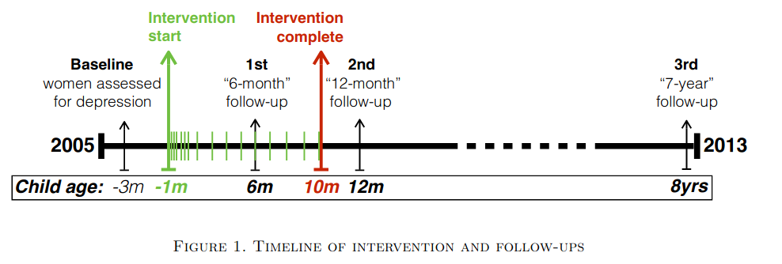

```{r setup, include=FALSE}
library(tidyverse)
library(skimr)
library(kableExtra)
library(broom)
library(forcats)
library(modelsummary)
knitr::opts_chunk$set(echo = TRUE, message=FALSE, warning = FALSE)
```

Im letzten Teil der Vorlesung hatten wir uns mit der (multiplen) linearen Regression beschäftigt und diese auf unsere Case-Study angewendet. Dadurch haben Sie das Rüstzeug erhalten um Koeffizienten einer linearen Regression interpretieren zu können. Weiterhin hatten Sie etwas komplexere Regressionen mit Interaktionstermen erstellt und auch diese interpretiert.

Im nun anstehenden Teil der Vorlesung wollen wir uns mit der Kausalität beschäftigen, insbesondere wann Sie (Regressions-)Ergebnisse kausal interpretieren können. 

Dafür betrachten wir uns sowohl in dieser Vorlesungseinheit, als auch im sechsten Problem Set eine aktuelle Studie aus dem American Economic Review. Dankenswerterweise haben die Autoren ihre Daten frei zugänglich gemacht und wir können diese selbst analysieren.

Die Studie, welche wir hier betrachten wollen, beschäftigt sich mit Wochenbettdepressionen und deren ökonomischen Konsequenzen. Die Studie untersucht die Behandlung von Wochenbettdepressionen durch psychologische Betreuung:

Baranov, Victoria, Sonia Bhalotra, Pietro Biroli, and Joanna Maselko. 2020. "Maternal Depression, Women's Empowerment, and Parental Investment: Evidence from a Randomized Controlled Trial." American Economic Review, 110 (3): 824-59. 

# Beschreibung des Experiments

Wochenbettdepressionen können bei Müttern während der Schwangerschaft und einige Zeit nach der Geburt auftreten. Schätzungsweise 10% - 20% aller werdenden Mütter leiden weltweit an Wochenbettdepressionen, wobei die Dunkelziffer hoch sein dürfte, insbesondere in den ärmeren Regionen der Welt. Die Folgen einer Wochenbettdepression können langfristige Effekte auf die ganze Familie haben. Neben den negativen Folgen für die Gesundheit der Frau und des Kindes, verursachen Depressionen auch hohe wirtschaftliche Kosten: Beispielsweise können dadurch Frauen nicht mehr arbeiten, oder die Kinder werden vernachlässigt und haben so schlechtere Chancen auf Bildung, ein niedrigeres Einkommen oder eine geringere Empathie. 

In dem vorliegenden Experiment wurden insgesamt 3518 Frauen mit klinischer Depression diagnostiziert, von denen 903 als werdende Mütter mit Wochenbettdepressionen identifiziert wurden. Diese werdenen Mütter wurden in die vorliegende Studie aufgenommen und zufällig der Treatment oder Kontrollgruppe zugeteilt. In der Treatment Gruppe erhielten die Mütter mit Wochenbettdepressionen neben der Standardbetreuung durch die Hebamme eine zusätzliche psychologische Betreuung, in der Kontrollgruppe nicht.

Nun fragen Sie sich sicher, ob die Mütter in der Kontrollgruppe nicht einfach selbst psychologische Hilfe organisieren konnten und dadurch der Effekt des Treatments potentiell verzerrt wäre. Jedoch kann ich Sie beruhigen: Das Experiment wurde in Pakistan durchgeführt und es gibt dort laut den Autoren fast kein Angebot an psychologischer Betreuung. Daher ist die Wahrscheinlichkeit das Mütter aus der Kontrollgruppe sich selbst psychologische Hilfe organisiert haben sehr gering.

In der folgenden Grafik sehen Sie die Interventionen innerhalb des Experiments. Die Studie begann im letzten Drittel der Schwangerschaft und die letzte Befragung der Teilnehmerinnen wurde 7 Jahre nach der Studie durchgeführt. Die grünen Striche markieren die Interventionen, konkret die Besuche der Hebamme bei den Müttern.

```{r, echo = FALSE}

```

Quelle: Baranov, Victoria, Sonia Bhalotra, Pietro Biroli, and Joanna Maselko. 2020. "Maternal Depression, Women's Empowerment, and Parental Investment: Evidence from a Randomized Controlled Trial." American Economic Review, 110 (3): 824-59.

## Deskriptive Analyse

Insgesamt enthält die Studie 394 unterschiedliche Variablen. Diese wollen wir uns nicht alle näher anschauen, sondern wir wollen uns auf die wichtigsten Variablen konzentrieren, welche auch in der Hauptstudie untersucht wurden. Bei diesen Variablen handelt es sich hauptsächlich um Informationen zu den Müttern (Bildungsstand, Alter ...) und deren Umfeld (lebt die Großmutter daheim, Bildung des Vaters, ...). In einem ersten Schritt wollen wir uns die Daten mittels skimr näher anschauen:

```{r}
options(scipen = 999)
thp <- read_csv("./data/THP_clean.csv") 

thp %>%
  select(treat, depressed_1y, age_baseline, mo_ht, mo_bmi, edu_mo_baseline, mo_emp, employed_mo_baseline, kids_no, first_child, gender_4sum, femshare, hamd_baseline, bdq_baseline, gaf_baseline, mspss_baseline, var29,  MIL, maternalgma, edu_fa_baseline, employed_fa_baseline, occupation_fa_baseline,  ses_bl_flipped, wealth_baseline_4sum) %>%
  skim()

```


Hier eine Erklärung der wichtigsten Variablen:

- depressed_1y: Dummy ob eine Frau 1 Jahr nach Entbindung Depressionen hatte.
- treat: Dummy ob eine Frau in einer Region mit Treatment lebt.
- age_baseline: Alter bei Eintritt in das Experiment in den letzten drei Monaten der Schwangerschaft.
- kids_no: Anzahl der Kinder insgesamt.
- edu_mo/edu_fa: Ausbildungsjahre der Mutter/des Vaters.
- employed_mo_baseline: Dummy ob die Mutter beim Eintritt in das Experiment gearbeitet hat.
- incomeindex: Wohlstandsindex des Haushalts bei Eintritt in das Experiment.
- mspss_baseline: Erhaltene Unterstützung vom sozialen Umfeld. (Skala von 0 bis 60)

Die Meisten unserer Variablen sind nicht komplett vollständig (oft fehlen 300 Beobachtungen, manchmal etwas mehr), was wir bei unserer Analyse bedenken sollten. Doch warum fehlen diese 300 Beobachtungen bei vielen Variablen? Dafür sollten wir uns die Anzahl an Beobachtungen näher anschauen (1203 Beobachtungen). Die 300 Beobachtungen, welche bei den Grundcharakteristika fehlen, lassen sich auf die zusätzliche Kontrollgruppe zurückführen, welche die Autoren in ihrer Befragung 7 Jahre nach der eigentlichen Studie noch mit einbezogen haben. Diese waren nicht in der Grundstudie enthalten. Wir konzentrieren uns in _unserer_ Analyse auf die 903 Mütter, welche in der Hauptstudie untersucht wurden. 

Weiterhin sehen wir, dass der Altersdurchschnitt der Mütter in unserem Datensatz bei 26,7 Jahren liegt (age_baseline) und diese im Schnitt bereits etwas mehr als 2 Kinder haben (kids_no). Weiterhin lebt in 49,6% aller Haushalte noch die Stiefoma mit im Haushalt (MIL). Insgesamt 42,6% der Mütter waren nach einem Jahr immer noch depressiv (depressed_1y).

Aus dieser ersten dekriptiven Analyse können wir bereits sehr viel über den Datensatz lernen. Insbesondere die Variable `treat` lässt uns vermuten, dass es eine Unterteilung in Treatment und Kontrollgruppe gegeben hat (treat = 51%). Allerdings lernen wir noch nichts darüber, wie erfolgreich die Randomisierung in der Studie in Treatment und Kontrollgruppe durchgeführt wurde. Dies können wir aus einer sogenannten Balancing Tabelle ablesen. In dieser Tabelle stellen wir die beobachtbaren Charakteristika der Treatmentgruppe denen der Kontrollgruppe gegenüber. 
War die Randomisierung erfolgreich, so sollten wir im Durchschnitt zwischen der Treatmentgruppe und der Kontrollgruppe keine Unterschiede in den Grundcharakteristika sehen. D.h. wir sollten gleiche Gruppen erhalten deren einziges Unterscheidungsmerkmal darin besteht getreatet worden zu sein.

## Balancing Tabelle

Wir wollen uns eine solche Balancing Tabelle erstellen und betrachten, in wie weit sich die Grundcharakteristika zwischen Treatment und Kontrollgruppe für das Basisjahr, das erste Jahr nach der Intervention, und 7 Jahre nach der Intervention unterscheiden:

```{r}
#baseline sample
baseline <- thp %>% 
  filter(THP_sample==1) %>%
  select( treat, age_baseline, mo_ht, mo_bmi, edu_mo_baseline, mo_emp, employed_mo_baseline, kids_no, first_child, gender_4sum, femshare, hamd_baseline, bdq_baseline, gaf_baseline, mspss_baseline, var29,  MIL, maternalgma,   edu_fa_baseline, employed_fa_baseline, occupation_fa_baseline,  ses_bl_flipped, wealth_baseline_4sum) %>%
  pivot_longer(cols = -treat, names_to = "variable", values_to = "value") %>%
  group_nest(variable) %>%
  mutate(t.test = map(data, ~tidy(t.test(value ~ treat, data = .x)))) %>%
  unnest(t.test) %>%
  mutate( Mean_Treatment = round(estimate2, 2),
          Mean_Kontrolle = round(estimate1, 2),
    Differenz = -round(estimate, 2),
          Signifikanz = round(p.value,2)) %>%
  select(Mean_Treatment, Mean_Kontrolle, Differenz, Signifikanz)

n.baseline <- thp %>% 
  filter(THP_sample == 1) %>%
  summarise(N = n())

#after one year
one.year <- thp %>% 
  filter(!is.na(attrit) & THP_sample == 1) %>%
  select( treat, age_baseline, mo_ht, mo_bmi, edu_mo_baseline, mo_emp, employed_mo_baseline, kids_no, first_child, gender_4sum, femshare, hamd_baseline, bdq_baseline, gaf_baseline, mspss_baseline, var29,  MIL, maternalgma,   edu_fa_baseline, employed_fa_baseline, occupation_fa_baseline,  ses_bl_flipped, wealth_baseline_4sum) %>%
  pivot_longer(cols = -treat, names_to = "variable", values_to = "value") %>%
  group_nest(variable) %>%
  mutate(t.test = map(data, ~tidy(t.test(value ~ treat, data = .x)))) %>%
  unnest(t.test) %>%
  mutate( Differenz = -round(estimate, 2),
          Signifikanz = round(p.value,2)) %>%
  select(Differenz, Signifikanz)

n.one.year <- thp %>% 
  filter(!is.na(attrit) & THP_sample == 1) %>%
  summarise(N = n())

#after 7 years
seven.years <- thp %>% 
  filter(attrit2 == 0 & THP_sample == 1) %>%
  select( treat, age_baseline, mo_ht, mo_bmi, edu_mo_baseline, mo_emp, employed_mo_baseline, kids_no, first_child, gender_4sum, femshare, hamd_baseline, bdq_baseline, gaf_baseline, mspss_baseline, var29,  MIL, maternalgma,   edu_fa_baseline, employed_fa_baseline, occupation_fa_baseline,  ses_bl_flipped, wealth_baseline_4sum) %>%
  pivot_longer(cols = `age_baseline`:`wealth_baseline_4sum`, names_to = "variable", values_to = "value") %>%
  group_nest(variable) %>%
  mutate(t.test = map(data, ~tidy(t.test(value ~ treat, data = .x)))) %>%
  unnest(t.test) %>%
  mutate( Differenz = -round(estimate, 2),
          Signifikanz = round(p.value,2)) %>%
  select(Differenz, Signifikanz)  

n.seven.years <- thp %>% 
  filter(attrit2 == 0 & THP_sample == 1) %>%
  summarise(N = n())

total <- baseline %>%
#  select(-variable) %>%
  cbind(one.year) %>%
  cbind(seven.years)
  
rownames(total) <- c("Alter der Mutter", "Behinderung", "Bildung des Vaters", "Bildung der Mutter", "Vater berufstätig", "Mutter arbeitet normalerweise", "Kind ist weibl.", "Erstes Kind",  "gaf_baseline", "Anteil an weibl. Kindern", "hamd_baseline", "Parität", "Oma im Haushalt", "Stiefoma im Haushalt", "BMI der Mutter", "mo_emp", "Größe der Mutter (in Meter)",  "Soziale Unterstützung", "Keine handwerkliche Arbeit", "SES", "var29", "Vermögensindex")

            #"Empowered",  "Parität",    "Depressions-Score", "Disability-Score", "General functioning", "Wahrgenommene Hilfe aus dem Umfeld", "Erweiterte Familie", 

total %>%
  kbl(col.names = c("Treatment", "Kontrolle","Differenz","p-Wert", "Differenz", "p-Wert", "Differenz", "p-Wert"), digits = 2, format = "html", 
      caption = "Balancing Tabelle für die Grundcharakteristika") %>%
  kable_styling(bootstrap_options = c("striped", "hover", "condensed", "responsive")) %>%
  kable_paper(full_width = F)  %>%
  add_header_above(c(" ", "Stichprobe Baseline (N = 903)" = 4, "Stichprobe 1-Jahr follow up (N = 704)" = 2, "Stichprobe 7-Jahre follow up (N = 585)" = 2)) %>%
#  row_spec(c(7,9, 11,12,13), bold = T, color = "white", background = "#BBBBBB")  %>%
  footnote(general = "Diese Tabelle testet, wie ausbalanciert die Beobachtungen in der Baseline Stichprobe, dem 1-Jahres follow-up und dem 7-Jahres follow-up sind. In den ersten beiden Spalten wird der Mittelwert für die Treatment bzw. Kontrollgruppe für die Baseline Stichprobe gezeigt. Spalte (3), (5) und (7) zeigen die Differenz zwischen den Mittelwerten der Treatment und Kontrollgruppe für die jeweilige Stichprobe und die Spalten (4), (6) und (8) zeigen die p-Werte und damit ob die einzelnen Mittelwerte statistisch signifikant unterschiedlich voneinander sind.") 


```

**Wann nutzt uns eine solche Balancing Tabelle?**

Wir sollten eine solche Tabelle immer dann erstellen, wenn wir uns nicht ganz sicher sein können, ob unsere Randomisierung erfolgreich war, d.h. insbesondere bei der Untersuchung von Feldexperimenten. 

1. In solchen Feldexperimenten ist es nicht zu 100% klar, dass die Randomisierung erfolgreich war, denn die tatsächliche Durchführung der Randomisierung liegt nicht gänzlich in der Hand des Forschers (beispielsweise arbeiteten die Forscher in diesem Experiment mit einer NGO zusammen und eventuell hatte die NGO Anreize das besonders viele Frauen getreatet werden). Durch eine Balancing Tabelle schauen wir, ob Treatment und Kontrollgruppe tatsächlich erfolgreich randomisiert wurden. 
2. Ein weiterer Grund, warum wir uns hier die Balancing Tabelle anschauen möchten ist die _Attrition_ (Schwundquote). Es ist völlig normal einige Teilnehmer in Feldexperimenten über die Zeit zu verlieren, da diese nicht antworten, verstorben sind oder aus anderen Gründen nicht mehr am Experiment teilnehmen möchten. Durch die Balancing Tabelle können wir anschauen, ob _Attrition_ selektiv stärker in der Treatment oder Kontrollgruppe war, zumindest auf Basis beobachtbarer Variablen.

Aus dieser Balancing Tabelle lernen wir mehrere Dinge:

- In den meisten Grundcharakteristika unterscheiden sich Treatment und Kontrollgruppe **nicht** voneinander.Die Differenz zwischen Treatment und Kontrollgruppe ist meist klein und nicht signifikant. Der t-Test, welchen wir für jede Variable durchgeführt haben testet die Nullhypothese: 

$H_0$: In der Treatment Gruppe zu sein hat keinen Einfluss auf die untersuchte Variable.

- Einige Variablen sind jedoch signifikant unterschiedlich zwischen Treatment und Kontrollgruppe, insbesondere ob die Oma väterlicherseits oder mütterlicherseits mit im Haushalt lebt.
- Wir verlieren einige Teilnehmer über die Zeit (903 -> 704 -> 585 Beobachtungen), d.h. wir haben nach 7 Jahren nur noch 64,8% der Mütter, die ursprünglich am Experiment teilgenommen haben, in der Stichprobe. Allerdings scheinen sich die Grundcharakteristika über die Zeit zwischen Treatment und Kontrollgruppe nicht signifikant verändert zu haben. D.h. es scheint keine Selektive Attrition für die Kontrollgrupppe oder die Treatment Gruppe gegeben zu haben. Die Bildung der Mutter und die Parität zwischen Mutter und Vater scheinen zwischen Treatment und Kontrollgruppe außeinander zu driften zwischen Treatment und Kontrollgruppe.

Auf Basis dieser ersten deskriptiven Analyse wollen wir uns tiefer mit den Unterschieden zwischen Treatment und Kontrollgruppe beschäftigen.

# Ergebnisse

## Grafische Analyse

Im ersten Schritt möchten wir uns die Unterschiede zwischen Treatment und Kontrollgruppe näher anschauen. Insbesondere interessiert uns, ob das Treatment erfolgreich war!

```{r}
thp %>%
  #filter( !is.na(depressed))  %>%
  select(treat, depressed_6m, depressed_1y, depressed) %>%
  mutate(Baseline = 1) %>%
  pivot_longer( cols = -treat, names_to = "name", values_to = "depression") %>%
  mutate(name = fct_relevel(name, "Baseline", "depressed_6m", "depressed_1y", "depressed"),
         name = fct_recode(name,
                           "6 Monate" = "depressed_6m",
                           "1 Jahr" = "depressed_1y",
                           "7 Jahre" = "depressed"),
         treat_factor = as.factor(ifelse(treat == 1, "Treatment", "Kontrolle"))) %>%
  ggplot(aes(x = name, y = depression, 
             color = treat_factor)) +
  scale_color_manual(values = c("#0072B2", "#E69F00")) +
  stat_summary(geom = "pointrange", 
               fun.data = "mean_se", 
               fun.args = list(mult=2.33)) +
  ylim(0,1) +
  theme_minimal() +
  theme(legend.title = element_blank(),
        legend.position = "bottom") +
  labs(x = NULL, 
       y = "Anteil an Depressionen",
       title = "Treatment Effekte auf den Anteil an Depressionen",
       caption = "Gezeigt wird der Mittelwert der Gruppen inklusive des 99% Konfidenzintervalls.\nEigene Analysen auf Basis von Baranov et al. (2020)") 

```

An dieser Grafik sehen wir einen besonders starken Effekt des Treatments nach 6 bzw. 12 Monaten. Der Unterschied zwischen Treatment und Kontrollgruppe liegt bei über 30 Prozentpunkten, wobei sich die Treatmentgruppe bereits nach 6 Monaten bei einem Anteil der Depressionen von rund 25% stabilisiert. Insbesondere die schnelle Erholung von der Depression bereits nach 6 Monaten ist für die Treatment Gruppe hoch signifikant und zeigt, wie effektiv die Intervention mit der psychologischen Betreuung war. Jedoch ist es auch wichtig zu sehen, dass auch ohne Treatment eine Erholung in der Kontrollgruppe stattgefunden hat. Diese Erholung ist deutlich schwächer, allerdings würde ein naiver Vergleich von vorher/nachher in der Treatment Gruppe (ohne Experiment) einen viel zu großen Effekt schätzen. Daher ist es wichtig ein solches Experiment zu untersuchen und die Treatment mit der Kontrollgruppe und nicht mit sich selbst zu vergleichen!
Auch nach sieben Jahren scheinen Mütter aus der Treatmentgruppe weniger häufig an Depressionen zu leiden (18%) als in der Kontrollgruppe (25%). Jedoch ist dieser Unterschied statistisch nicht signifikant. 

Anhand dieser Grafik können wir sehr schön die Effektivität der Intervention beobachten. Insbesondere da es sich bei der psychologischen Betreuung um eine kostengünstige Alternative zu Psychopharmaka handelt (und die psychologische Betreuung bei stillenden Müttern bedenkenlos eingesetzt werden kann) ist dieses Ergebnis beeindruckend.

## Regressionsanalyse 

In der folgenden Tabelle wollen wir uns die Ergebnisse mittels linearer Regression anschauen, bei der wir zusätzlich auf mögliche _Confounder_ kontrollieren können. Wir wollen uns in diesen Regressionen nur die Ergebnisse für Mütter anschauen, welche auch nach sieben Jahren noch in unserer Stichprobe sind. Hierdurch können wir die Ergebnisse zwischen den einzelnen Jahren besser vergleichen. Im ersten Schritt wollen wir auf keine sonstigen Variablen kontrollieren. Dies sollte bei einem perfekt randomisierten Experiment vollkommen ausreichen. Wir erhalten hierbei die selben Ergebnisse wie in unserem obigen Schaubild! Auch nach der Kontrolle auf viele soziodemografische Variablen erhalten wir sehr ähnliche Ergebnisse. 
Es zeigt sich, was wir bereits in unserer Balancing Tabelle gesehen haben: Die Randomisierung in Treatment und Kontrollgruppe war erfolgreich. 
Für uns bedeutet dies: Wir müssen in den folgenden Regressionen auf keine _Confounder_ kontrollieren.

Die Intervention war insbesondere für das erste Jahr extrem erfolgreich, mit einer Reduktion der Depressionen um **über 30 Prozentpunkte** im Vergleich zur Kontrollgruppe! 
Nach 7 Jahren gab es auch in der Kontrollgruppe viele Mütter, die sich von der Depression erholt hatten, daher haben sich hier die Kontrollgruppe und die Treatment-Gruppe einander angenähert, aber auch hier leiden Mütter aus der Treatment-Gruppe um **5 - 6 Prozentpunkte weniger häufig** (je nach Spezifikation) an Depressionen, wobei diese Koeffizienten statistisch nicht signifikant sind.

```{r, results = 'asis'}
reg_dep6m <- lm(depressed_6m ~ treat, data = filter(thp, attrit2 == 0 & THP_sample == 1))
reg_dep6m_long <- lm(depressed_6m ~ treat + age_baseline + age_baseline_sq + employed_mo_baseline + mo_emp + grandmother_baseline + MIL + wealth_baseline + edu_lvl_mo_1 + edu_lvl_mo_2 + edu_lvl_mo_3 + edu_mo_baseline + edu_fa_baseline + kids_no + first_child + hamd_baseline + mspss_baseline + month_int + month_int_sq + doi0 + intervr_1 + intervr_2 + intervr_3 +intervr_4 + intervr_5 + intervr_6 + intervr_7 + intervr_8 + intervr_9, data = filter(thp, attrit2 == 0 & THP_sample == 1))

reg_dep1y <- lm(depressed_1y ~ treat, data =  filter(thp, attrit2 == 0 & THP_sample == 1))
reg_dep1y_long <- lm(depressed_1y ~ treat + age_baseline + age_baseline_sq + employed_mo_baseline + mo_emp + grandmother_baseline + MIL + wealth_baseline + edu_lvl_mo_1 + edu_lvl_mo_2 + edu_lvl_mo_3 + edu_mo_baseline + edu_fa_baseline + kids_no + first_child + hamd_baseline + mspss_baseline + month_int + month_int_sq + doi0 + intervr_1 + intervr_2 + intervr_3 +intervr_4 + intervr_5 + intervr_6 + intervr_7 + intervr_8 + intervr_9, data = filter(thp, attrit2 == 0 & THP_sample == 1))

reg_dep7y <- lm(depressed ~ treat, data = filter(thp, attrit2 == 0 & THP_sample == 1))
reg_dep7y_long <- lm(depressed ~ treat + age_baseline + age_baseline_sq + employed_mo_baseline + mo_emp + grandmother_baseline + MIL + wealth_baseline + edu_lvl_mo_1 + edu_lvl_mo_2 + edu_lvl_mo_3 + edu_mo_baseline + edu_fa_baseline + kids_no + first_child + hamd_baseline + mspss_baseline + month_int + month_int_sq + doi0 + intervr_1 + intervr_2 + intervr_3 +intervr_4 + intervr_5 + intervr_6 + intervr_7 + intervr_8 + intervr_9, data = filter(thp, attrit2 == 0 & THP_sample == 1))

rows <- tribble(~term,          ~reg_dep6m,  ~reg_dep6m_long, ~reg_dep1y, ~reg_dep1y_long, ~reg_dep7y, ~reg_dep7y_long,
                "Kontrollvariablen", "Nein", "Ja", "Nein", "Ja", "Nein", "Ja")

attr(rows, 'position') <- c(3)

modelsummary(list(reg_dep6m, reg_dep6m_long, reg_dep1y, reg_dep1y_long, reg_dep7y, reg_dep7y_long), 
          type = "html",
          keep = "treat",
          coef_rename = c("treat" = "Treatment"),
          add_rows = rows,
          stars = c('*' = .1, '**' = 0.05, '***' = .01),
          gof_omit = 'DF|Deviance|RMSE|AIC|BIC|Log.Lik|F',
          title = "Depression bei Müttern, mit und ohne Kontrollvariablen") %>%
          add_header_above(c(" " = 1,"Nach 6 Monaten" = 2, "Nach 1 Jahr" = 2, "Nach 7 Jahren" = 2))

```

## Ökonomische Auswirkungen der Behandlung

Im letzten Schritt möchten wir uns noch die ökonomischen Auswirkungen der Behandlung auf Mütter mit Depressionen anschauen. In Pakistan haben Frauen allgemein nur eine geringe Kontrolle über die finanziellen Ressourcen ihrer Familie. Allerdings würden wir annehmen das bei Frauen mit Depressionen diese Kontrolle noch deutlich kleiner sein dürfte, als bei Müttern ohne Depressionen. Insbesondere da Mütter mit Depressionen vermutlich nicht auch noch mit finanziellen Gegebenheiten belastet werden wollen.

In unserer Studie gibt es sehr viele unterscheidliche Variablen, welche die finanzielle Eigenständigkeit (und andere Größen) der Mütter erfassen. Die Autoren der Studie haben weiterhin aus diese Variablen im Datensatz eigene Indizes erstellt, in denen mehrere Variablen zusammengefasst wurden. Die wichtigsten Indizes wollen wir uns näher anschauen:

- "Finanziellen Stärkung" der Mutter: Mutter arbeitet, Einkommen der Mutter, Kontrolle der Mutter über die Ausgaben
- "Monetäres Investment (in das Kind)": Ausgaben für Schule, Lernmaterialien, sonstige Infos zur Schule und Ausgaben
- "Zeitliches Investment (in das Kind)": Wie oft spielen Mutter/Vater mit dem Kind?, oder helfen mit den Hausaufgaben?
- "Erziehungsstil": Wie spricht die Mutter mit dem Kind?; welche Art der Disziplinierung wird angewendet?
- "Fruchtbarkeit": Wie viele Kinder hatte die Mutter nach dem aktuellen Kind? Perfekte Anzahl an Kindern abgefragt.

```{r}

reg_financial <- lm(motherfinancial ~ treat, data = filter(thp, attrit2 == 0 & THP_sample == 1)) 
reg_money <- lm(parentmoney ~ treat, data = filter(thp, attrit2 == 0 & THP_sample == 1))
reg_time<- lm(parenttime ~ treat, data = filter(thp, attrit2 == 0 & THP_sample == 1))
reg_style <- lm(parentstyle ~ treat, data = filter(thp, attrit2 == 0 & THP_sample == 1))
reg_fertility <- lm(fertility_vars ~ treat, data = filter(thp, attrit2 == 0 & THP_sample == 1))


tidy(reg_financial, conf.int = T) %>%
  mutate(term = ifelse( term == "treat", "fin_emp", term))%>%
  bind_rows(tidy(reg_money, conf.int = T)) %>%
  mutate(term = ifelse( term == "treat", "money", term)) %>%
  bind_rows(tidy(reg_time, conf.int = T)) %>%
  mutate(term = ifelse( term == "treat", "time", term)) %>%
  bind_rows(tidy(reg_style, conf.int = T)) %>%
  mutate(term = ifelse( term == "treat", "style", term)) %>%
  bind_rows(tidy(reg_fertility, conf.int = T)) %>%
  mutate(term = ifelse( term == "treat", "fertility", term)) %>%
  filter( term != "(Intercept)") %>%
    mutate(term = fct_relevel(term, "fertility", "style", "time", "money", "fin_emp"),
           term = fct_recode(term,
                           "Finanzielle Stärkung" = "fin_emp",
                           "Monetäre Investments" = "money",
                           "Zeitliche Investments" = "time",
                           "Erziehungsstil" = "style",
                           "Fruchtbarkeit" = "fertility")) %>%
  ggplot(aes(x = term, y=estimate, ymin=conf.low, ymax=conf.high)) +
  geom_pointrange() +
  geom_hline(yintercept = 0, col = "orange") +
  scale_y_continuous(breaks = c(-0.25,0,0.25,0.5)) +
 # ylim(-0.5,0.6) +
  coord_flip() +
  labs(
    x = NULL, y = "Effektgröße als Standardabweichung der Kontrollgruppe",
    title = "Effekt der Intervention auf ökonomische Entscheidungen der Mutter", 
    subtitle = "95% Konfidenzintervall um den Punktschätzer"
    ) +
  theme_minimal()
```

Die Intervention führte bei der finanziellen Lage der depressiven Mütter zu einer Verbesserung um 0.34 Standardabweichungen (SD), verglichen mit der Kontrollgruppe. Weiterhin wurde 0.35 SD mehr in das Kind investiert (monetär), verglichen mit der Kontrollgruppe und die Eltern spielten 0.31 SD häufiger mit dem Kind als die Eltern der Kontrollgruppe. Diese Ergebnisse sind alle signifikant auf dem 1%-Signifikanzniveau, wie wir in der obigen Grafik sehen können.

Interessanterweise gab es keinen signifikanten Effekt der Intervention auf den Erziehungsstil oder die Fruchtbarkeit (d.h. wie viele Kinder die diese nach dem aktuellen Kind hatten).


# Interne Validität

## Probleme der Studie: Attrition

Insgesamt sind die Autoren der Studie bemüht auf ein großes Problem ihrer Studie hinzuweisen: Die Attrition, d.h. der Schwund der Teilnehmer in ihrer Stichprobe.

Durch ein Feldexperiment, insbesondere durch die Randomisierung der Teilnehmer in eine Treatment und Kontrollgruppe, ist es möglich sehr viele Probleme bezüglich interner Validität zu lösen. Es gibt keine _Confounder_ mehr, welche die Ergebnisse verzerren können und Selbstselektion o.ä. ist kein Thema. Doch wenn wir eine Studie durchführen, die über sieben Jahre geht, dann bleibt ein Thema, welches durch Randomisierung nicht gelöst werden kann: Die Attrition!

Wenn nun selektiv mehr Teilnehmer in der Treatmentgruppe die Studie verlassen, möglicherweise auch noch auf Grund des Treatments, dann bekommen wir verzerrte Ergebnisse in unseren späteren Analysen, die wir nur sehr schlecht auflösen könnten.
Um dem Leser zu zeigen, dass es keine selektive Attrition in unserer Stichprobe gab, sondern das diese für Treatment und Kontrollgruppe ähnlich groß waren hatten wir uns bereits dazu entschlossen eine Balancing Tabelle zu erstellen. Attrition scheint in unserem Fall zwar vorhanden zu sein, doch nicht selektiv nur für die Treatment oder nur für die Kontrollgruppe.

Wenn Sie eine derart lange Studie planen, dann sollten Sie versuchen möglichst viele Informationen über die Teilnehmer an ihrem Experiment zu gewinnen. Anhand dieser Charakteristika können Sie dann untersuchen, in wie weit die Attrition zwischen der Treatment und Kontrollgruppe zufällig oder systematisch war.

# Zusammenfassung

Wochenbettdepressionen sind weltweit bei 10 - 20% der werdenden Mütter zu beobachten (wobei die Dunkelziffer hoch sein dürfte). Dabei haben solche Depressionen langfristige Auswirkungen, sowohl auf die Kinder der Frau, als auch auf die Teilhabe der Frau am Arbeitsmarkt. Um die gesellschaftlichen und ökonomischen Kosten von Wochenbettdepressionen einzudämmen wurde hierzu in der vorliegenden Untersuchung ein Experiment durchgeführt in dem eine Treatment Gruppe psychologische Betreuung für die Depressionen angeboten wurde, und der Kontrollgruppe nicht. Diese psychologische Betreuung hatte sehr starke Effekte auf die Depression der Mütter nach einem Jahr. Mütter mit psychologischer Betreuung hatten nur noch in rund 25 Prozent der Fälle eine Depression, in der Kontrollgruppe lag der Anteil bei über 50 Prozent. Auch nach sieben Jahren war noch eine Differenz zwischen Treatment und Kontrollgruppe von 6 Prozentpunkten sichtbar (allerdings nicht mehr statistisch signifikant). 

Neben den direkten Effekten in Form eines geringeren Anteils von depressiven Müttern hatte die Intervention den Effekt, dass die Mütter im Treatment in ihrer finanziellen Handhabe unabhängiger wurden und mehr in ihr Kind investierten (sowohl monetär als auch zeitlich). Dies spricht dafür, dass die relativ günstige Intervention durch die psychologische Betreuung sehr erfolgreich war und eine klare Alternative zu Antidepressiva darstellt. Natürlich auch vor dem Hintergrund das stillende Mütter keine Antidepressiva nutzen sollten.