```{r setup, include=F}
#knitr::opts_chunk$set(fig.width = 6, message = F, warning = F, eval =F,
#                      comment = "", cache = F)
knitr::opts_chunk$set(fig.width = 6,  message = F, warning = F, eval =TRUE, cache = F)
library(knitr)
```

```{css, echo = FALSE}
.remark-code{line-height: 1.5; font-size: 80%}
@media print {
  .has-continuation {
    display: block;
  }
}
```


## Elemente eines RMarkdown Dokuments

.question[Welche Elemente hat eine R Markdown Datei?]

--

.pull-left[

- **YAML-Header**

]

.pull-right[

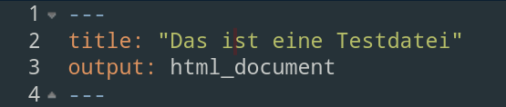
]

---

## Elemente eines RMarkdown Dokuments

.question[Welche Elemente hat eine R Markdown Datei?]

.pull-left[

- YAML-Header
- **Text**

]

.pull-right[

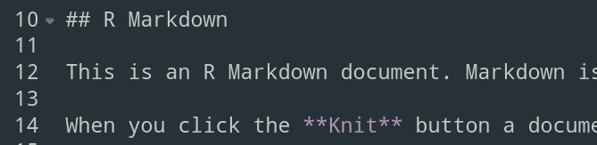
]

---

## Elemente eines RMarkdown Dokuments

.question[Welche Elemente hat eine R Markdown Datei?]

.pull-left[

- YAML-Header
- Text
- **Code-Chunks**
]

.pull-right[

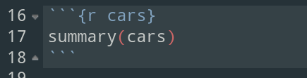
]

---

class: inverse, center, middle

# Metadaten in RMarkdown

---

## Überblick übr YAML

- .Rmd Dokumente beginnen mit einem YAML-Header
  - Definition der Metadaten wie Titel, Datum, Output-Format ...
- Wir zwischen drei `---` geschrieben

```
---
title:
output:
---
```
--
- Variablennamen (`title`, `output` etc) werden immer _klein_ geschrieben und darauf folgt ein Doppelpunkt `:` mit anschließendem Leerzeichen
- Alle verfügbaren Variablen und deren Optionen finden Sie in [Pandoc's User Guide](https://pandoc.org/MANUAL.html)
  - Außerdem ist das [R Markdown Cheat Sheet](https://github.com/rstudio/cheatsheets/raw/master/rmarkdown-2.0.pdf) sehr hilfreich
  
---

## YAML Variablen

YAML Variablen können **Text**

```
---
*title: "Das ist ein Text"
output:
---
```

---

## YAML Variablen

YAML Variablen können Text, **Optionen**

```
---
title: "Das ist ein Text"
*output: html_document
---
```

---

## YAML Variablen

YAML Variablen können Text, Optionen, **Unteroptionen**

```
---
title: "Das ist ein Text"
output: 
  html_document:
*    keep_md: TRUE
---
```

---

## YAML Variablen

YAML Variablen können Text, Optionen, Unteroptionen und **Code** enthalten

```
---
title: "Das ist ein Text"
*date: "r format(Sys.Date(), '%d %B %Y')"
output: 
  html_document:
    keep_md: TRUE
---
```

--

Im Projektkurs erstellen wir HTMLs _und_ Markdown Dokumente durch folgenden YAML-Header:

```{r, eval=FALSE}
---
title: "Das ist ein Text"
*output: 
*  html_document:
*    keep_md: TRUE
---
```

--

- Sie müssen auf das _Einrücken_ der dritten Zeile (keep_md) achten!


---

## HTML aufwerten

.instructions[Kleine Änderungen im YAML Header haben große Auswirkungen!]

--

```{r,echo=FALSE, out.width='80%'}
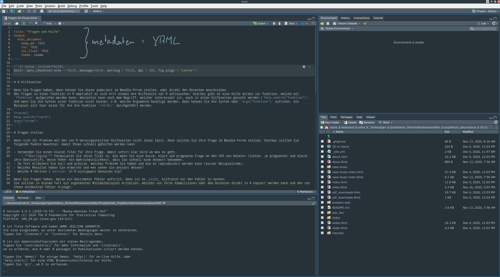
```

---

## HTML aufwerten

.instructions[Kleine Änderungen im YAML Header haben große Auswirkungen!]

```{r,echo=FALSE, out.width='140%'}
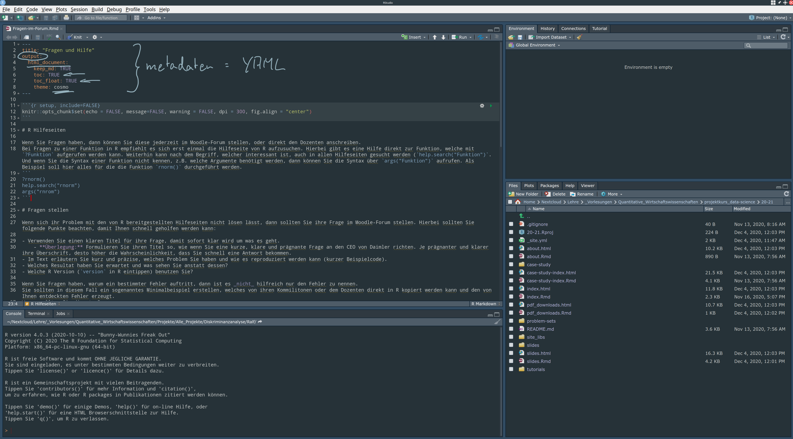
```

---

## HTML aufwerten

.pull-left[
**Nur mit output: html_document**

```{r,echo=FALSE, out.width='70%'}
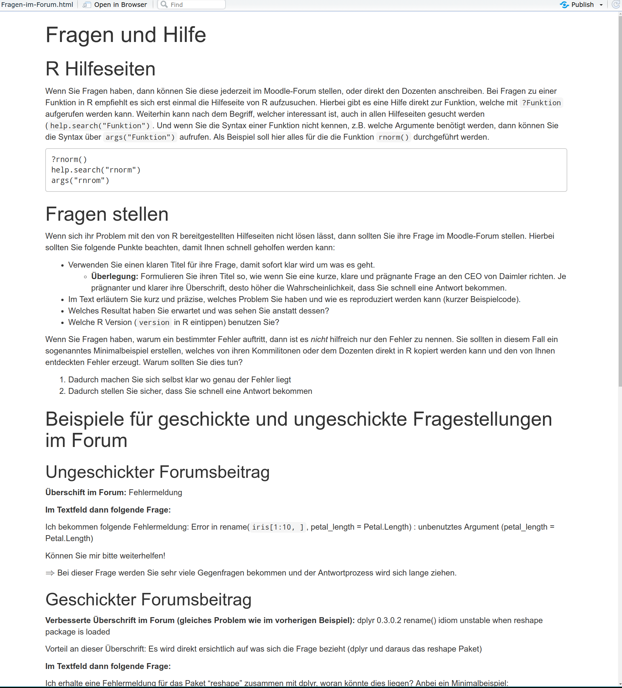
```
]

.pull-right[
**theme, toc und toc_float definiert**

```{r,echo=FALSE, out.width='80%'}
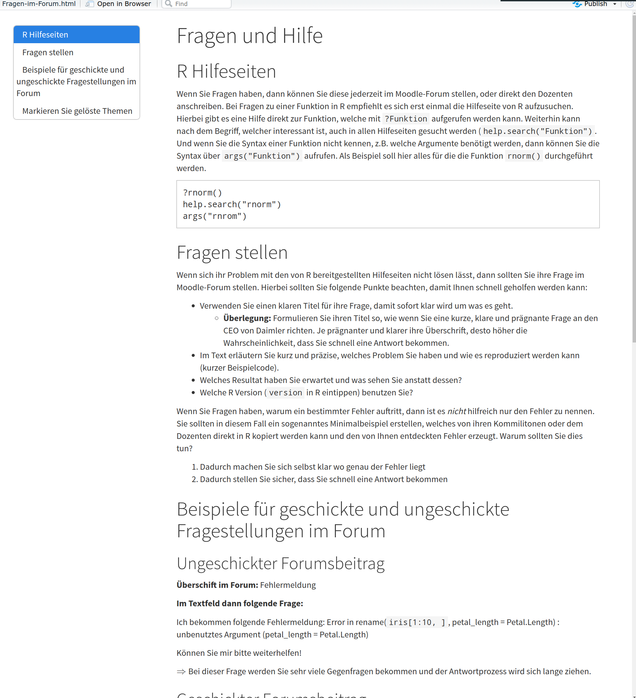
```
]

---

## HTML aufwerten

```{r,echo=FALSE, out.width='80%'}

```

---

## HTML aufwerten

```{r,echo=FALSE, out.width='80%'}

```

---

## HTML aufwerten

```{r,echo=FALSE, out.width='80%'}
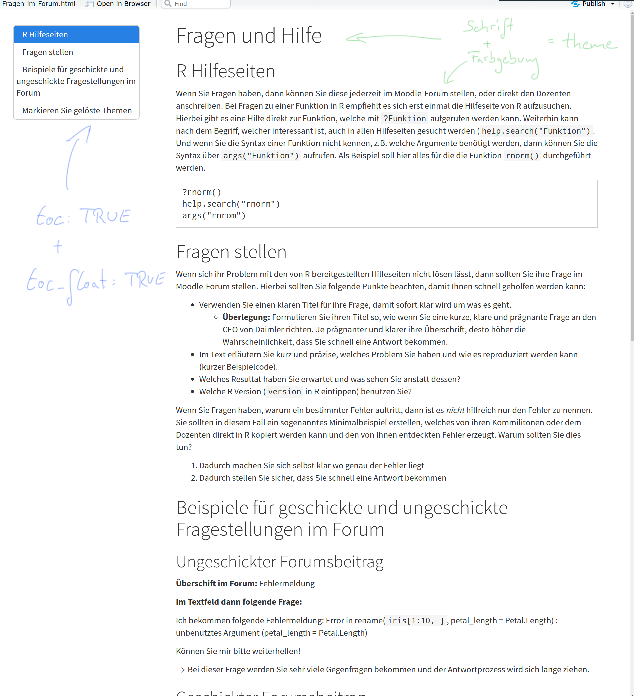
```

---

## HTML aufwerten

Im Projektkurs nutzen wir das theme = "cosmo" und setzen ein Inhaltsverzeichnis (toc = TRUE) ein.
Dieses Inhaltsverzeichnis soll an der linken Seite der HTML erscheinen (toc_float = TRUE).

```{r, eval=FALSE}
---
title: "Das ist ein Text"
*output: 
*  html_document:
*    keep_md: TRUE
*    toc: TRUE
*    toc_float: TRUE
*    theme: "cosmo"
---
```

--

Es gibt auch noch andere Themes. Diese finden Sie [hier](https://www.datadreaming.org/post/r-markdown-theme-gallery/) (aber bitte nicht im Projektkurs verwenden!)

---

## Von R Markdown zum gewünschten Output-Format

Durch das komplieren ( `knitten` ) ihres Dokuments bekommen Sie das von ihnen angegebene Dokument

> .Rmd --knitr --> .md --pandoc --> output

- Knitr konvertiert ihr Dokument von .Rmd (RMarkdown) in eine .md (Markdown) Datei
- `pandoc` transformiert die .md Datei anschließend in ihr gewünschtes Format
  - Bspw. HTML, Word, PDF, LateX ...
- In R-Studio drücken Sie für diesen Prozess einfach den `knitr`-Button

```{r, out.width='80%', echo=FALSE}
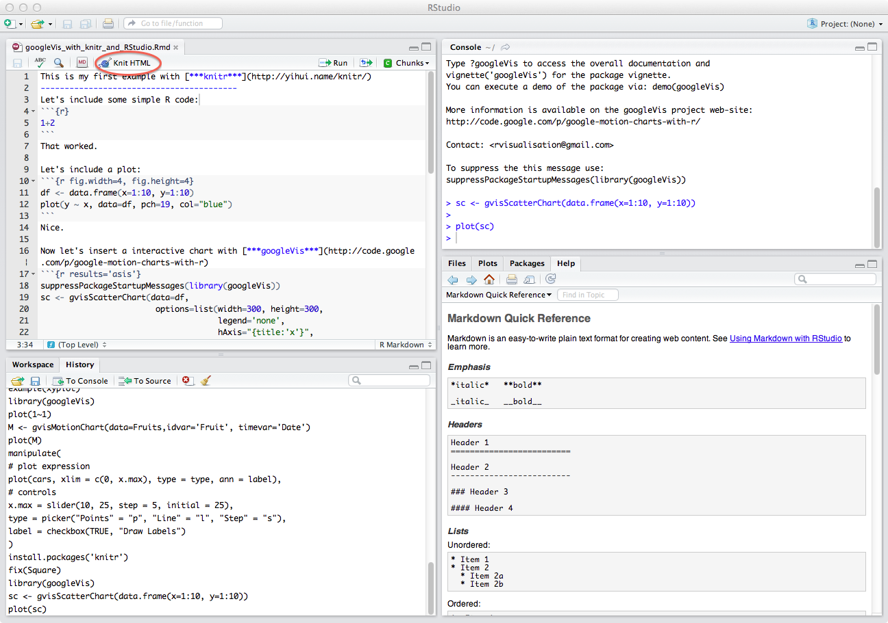
```

---

class: center
background-image: url("figs/rmd_flowchart.png")
background-size: contain


---

## Vielseitigkeit von RMarkdown

- HTMLs
- Github Markdown Dokumente
- PDFs
- Präsentationen
- Dashboards
- Bücher (Stichwort `bookdown`)
- Webseiten (Stichwort `blogdown`)
- und noch vieles weitere ... 

Eine ausführliche Erklärung im open access Buch: [RMarkdown the definitive Guide](https://bookdown.org/yihui/rmarkdown/)

Oder auch im [R Markdown Reference Guide](https://rmarkdown.rstudio.com/docs/reference/index.html#section-output-formats)

---

## TeX Installation um PDFs erzeugen zu können

Falls Sie eine TeX-Live oder andere TeX/LateX Version auf ihrem Rechner installiert haben `r emo::ji("heavy_check_mark")`

--

Falls nicht, dann können Sie sich eine Minimale TeX-Version (tinytex von Xie(2020)) über R installieren:

```{r, eval = FALSE, echo=TRUE}
install.packages(c("tinytex"))
tinytex::install_tinytex()
```

---

## YAML - Output Formate

.pull-left[
Es können unterschiedlichste Output Formate erzeugt werden.

Unter anderen:
- **HTML**

```{r, eval=FALSE}
---
title: "Das ist ein Text"
*output: html_document
---
```
]

.pull-right[
```{r, echo=FALSE, out.width='80%'}
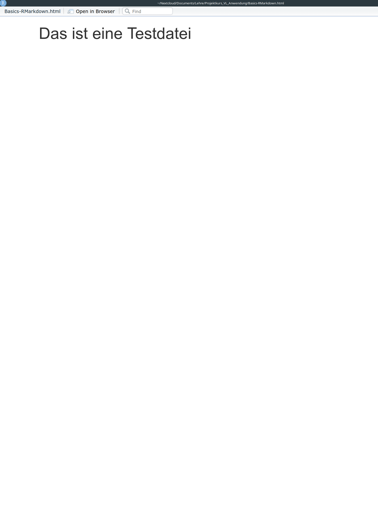
```

]

---

## YAML - Output Formate

.pull-left[
Es können unterschiedlichste Output Formate erzeugt werden.

Unter anderen:
- HTML
- **Latex**

```{r, eval=FALSE}
---
title: "Das ist ein Text"
*output: latex_document
---
```
]

.pull-right[
```{r, echo=FALSE, out.width='80%'}
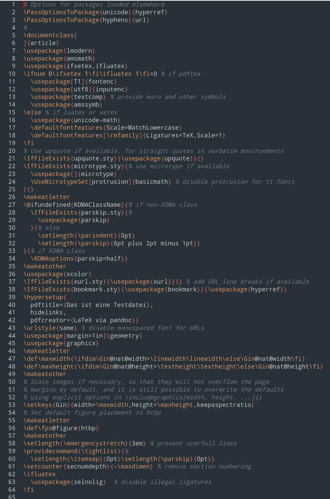
```

]

---

## YAML - Output Formate

.pull-left[
Es können unterschiedlichste Output Formate erzeugt werden.

Unter anderen:
- HTML
- Latex
- **PDF**

```{r, eval=FALSE}
---
title: "Das ist ein Text"
*output: pdf_document
---
```
]

.pull-right[
```{r, echo=FALSE, out.width='80%'}
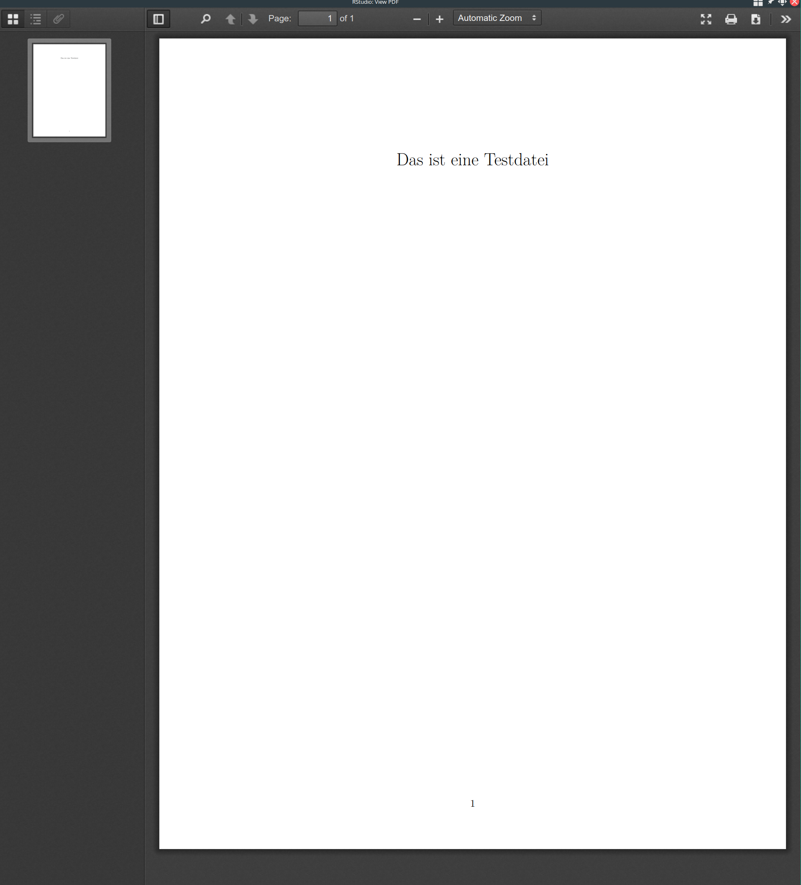
```

]

---

## YAML - Output Formate

.pull-left[
Es können unterschiedlichste Output Formate erzeugt werden.

Unter anderen:
- HTML
- Latex
- PDF
- **Word**

```{r, eval=FALSE}
---
title: "Das ist ein Text"
*output: word_document
---
```
]

.pull-right[
```{r, echo=FALSE, out.width='80%'}
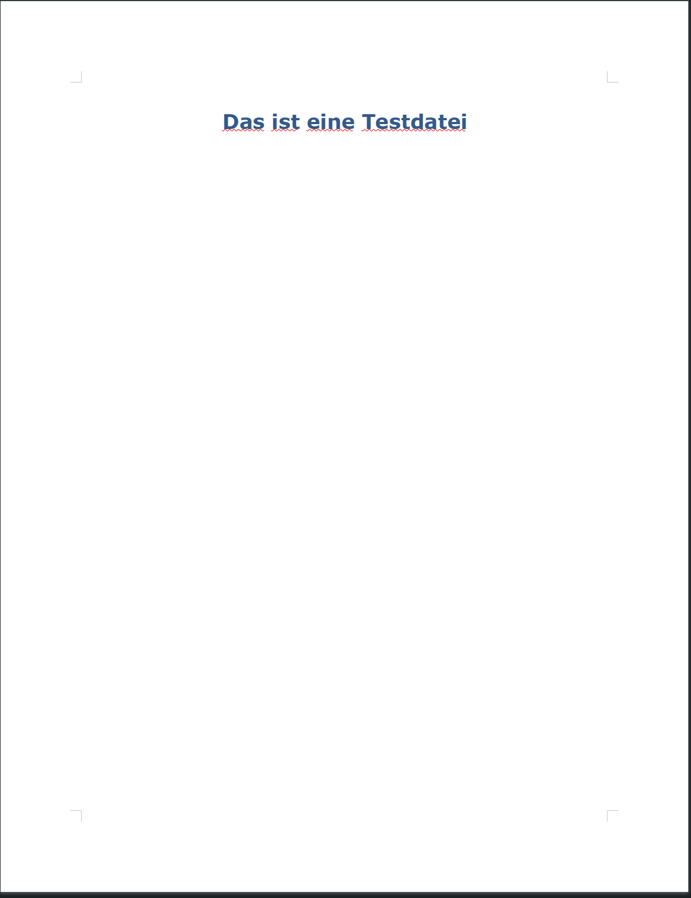
```

]

---

## YAML - Output Formate

- Wir erzeugen im Projektkurs eine HTML **und** .md-Dateien um das Projekt auch immer in Github schnell anschauen zu können

.alert[Probieren Sie es aus! Klicken Sie auf die .md-Datei ihres 1. Projekts auf Github!]

---

class: center
background-image: url("figs/rmarkdown_hedgehog_wide.png")
background-size: contain

---

class: inverse, center, middle

# Code Chunk Optionen

---

## Code Chunk Optionen

In einem Chunk haben Sie mehrere Optionen, wie dieser von R interpretiert werden soll.

Allgemeiner Chunk:

- echo: "TRUE"/"FALSE" (Code aus Chunk zeigen/nicht zeigen)
- message: "TRUE"/"FALSE" (Benachrichtigungen anzeigen/nicht anzeigen)
- warnings: "TRUE"/"FALSE" (Warnmeldungen anzeigen/nicht anzeigen)
- eval: "TRUE"/"FALSE" (Chunk nicht beachten/beachten)
- include: "TRUE"/"FALSE" (Code Output zeigen/nicht zeigen)
- results: "asis"/"hide" (Output wie er vom Chunk kommt anzeigen/nicht zeigen)

--

Zusätzlich bei Schaubildern:

- out.width: Nummer (Breite des Outputs, kann auch in '%' angegeben werden)
- fig.height: Nummer (Höhe eines Schaubilds festlegen)
- fig.width: Nummer (Breite eines Schaubilds festlegen)
- dpi: Nummer (Qualität ihrer Grafik, für eine höhere Qualität dpi=300 angeben)

---

## echo

.alert[Wir nutzen den in `tidyverse` enthaltenen Datensatz `economics` als Basis für die folgenden Schaubilder.]

.pull-left[

````
```{r, echo=FALSE}`r ''`
library(tidyverse)
summary(economics)
```
````

]

--

.pull-right[

```{r, echo = FALSE, message =TRUE, warning = TRUE}
library(tidyverse)
summary(economics)
```

]

---

## message/warning

.pull-left[

````
```{r, message = FALSE, warning = FALSE}`r ''`
library(tidyverse)
```
````

]

--

.pull-right[

```{r, message = FALSE, warning = FALSE}
library(tidyverse)
```

]

---

## eval

.pull-left[

````
```{r, eval=FALSE}`r ''`
library(tidyverse)
summary(economics)
```
````

]

--

.pull-right[

```{r, eval = FALSE}
library(tidyverse)
summary(economics)
```

]


---

## out.width

.pull-left[

````
```{r, out.width = '70%', echo=FALSE}`r ''`
library(tidyverse)
qplot(economics$pop)
```
````

```{r, out.width = '70%', echo=FALSE}
library(tidyverse)
qplot(economics$pop)
```

]

--

.pull-right[

````
```{r, out.width = '10%', echo=FALSE}`r ''`
library(tidyverse)
qplot(economics$pop)
```
````

```{r, out.width = '10%', echo=FALSE}
library(tidyverse)
qplot(economics$pop)
```

Andere Optionen bspw.:
- fig.width
- fig.high
]

---

## Global **setup** chunks

.pull-left[

One Chunk to rule them all. (Alison Hill)

````
```{r setup, include = FALSE}`r ''`
knitr::opts_chunk$set(
  warning = FALSE,
  message = FALSE,
  echo = FALSE,
  fig.path = "figs/"
)
```
````

]

.pull-right[

- Chunk bekommt das Label **`setup`**
- Ist der erste Chunk in einem RMarkdown Dokument
- Hier werden globale Optionen für alle folgenden Chunks definiert
- Sie können weiterhin in jedem Chunk individuelle Optionen verwenden und diese globalen Optionen überschreiben
- **Tipp:** Verwenden Sie für den **setup** Chunk **include = FALSE** damit er nicht im Dokuemnt auftaucht
]


---

class: inverse, center, middle

# Präsentationen mit R Markdown

---

## Präsentationen mit R Markdown mit dem Paket `xaringan`

.instructions[Wir wollen uns noch speziell mit Präsentationen mit R Markdown beschäftigen!]

--

- Ihre Projektausarbeitung ist bereits in R Markdown
- Durch kleine Änderungen im YAML-Header können Sie daraus eine Präsentation erstellen mit Grafiken direkt aus R mit hoher Qualität 
  - **Pro Tip**: Im Code Chunk `dpi = 300` verwenden für gestochen scharfe Grafiken

```{r, eval=FALSE}
#install.packages(xaringan)
library(xaringan)
```

---

## Output-Format


```
---
output: xaringan::moon_reader
---
```


---

## Neue Folien

.pull-left[

- Die erste Folie beginnt dort wo der YAML-Header endet!
- Durch drei --- können Sie eine neue Folie beginnen
]

.pull-right[


```
---
output: xaringan::moon_reader
---

Ich bin ihre 1. Folie

---

Und ich ihre zweite
```

]

---

## Neue Folien

.pull-left[

- Die erste Folie beginnt dort wo der YAML-Header endet!
- Durch drei --- können Sie eine neue Folie beginnen
]

.pull-right[


```
---
output: xaringan::moon_reader
---

Ich bin ihre 1. Folie

---

Und ich ihre zweite
```

]   

---

## Neue Folien designen

.pull-left[

.alert[Sie können jede Folie individuell designen mit der `class:` Option.]

Möglichkeiten:
- Für die Position des Geschriebenen (vertikal): top, bottom, middle 
- Für die Position des Geschriebenen (horizontal): left, right, center
- Um das Farbschema umzudrehen: inverse

]

.pull-right[


```
---
output: xaringan::moon_reader
---

class: inverse, center, middle

# Introfolie

---

class: bottom, right

# Vorstellung

Ich bin ihre 1. Folie

---

Und ich ihre zweite
```

]

---

# Das Paket `xaringanthemer`

```{r, eval=FALSE}
#install.packages("xaringanthemer")
library(xaringanthemer)
```

- Damit können Sie ihre Präsentationen auch ohne CSS oder remark.js Kenntnisse leicht anpassen und individualisieren
- Eine Einführung in xaringanthemer finden Sie [hier](https://pkg.garrickadenbuie.com/xaringanthemer/)
- Eine Einführung in xaringan finden Sie [hier](https://slides.yihui.org/xaringan/#1)

---

# Ein beispielhafter YAML-Header


```
---
author: Alexander Rieber
date: '`r format(Sys.Date())`'
title: Beispielpräsentation in xaringan
output: 
  xaringan::moon_reader
    css: xaringan-themer.css
---
```

````
```{r xaringan-themer, include=FALSE, warning=FALSE}`r ''`
library(xaringanthemer)
style_mono_accent(
  #Farbpalette richtet sich nach Hex-Farbcode (bspw. hier: https://encycolorpedia.de/)
  #Farbpalette kann leicht angepasst werden
  base_color = "#1c5253", 
  header_font_google = google_font("Josefin Sans"),
  text_font_google   = google_font("Montserrat", "300", "300i"),
  code_font_google   = google_font("Fira Mono")
)
```
````

---

# Präsentationen 

- Sie können sich auch gerne an den Folien zum Projektkurs orientieren z.B. mit dem Format 16:9 (ratio: "16:9")
- Natürlich müssen Sie ihre Ausarbeitung nicht in xaringan machen!

.instructions[Jedoch bietet es sich an um die schönen Grafiken und Tabellen ohne Verlust in die Präsentation aufnehmen zu können.]
---

class: inverse, center,middle

# R Projekte

---

## Arbeiten mit R-Projekten

In R sollten Sie ihre Arbeit in Projekte strukturieren. 

Ist sehr nützlich da in dem Fall alle nötigen Dateien beieinander in einem Projekt liegen, inkl. Historie etc.
  - Mehr Informationen zu R-Projekten und warum diese sinnvoll sind finden Sie [hier](https://support.rstudio.com/hc/en-us/articles/200526207-Using-Projects)

.alert[Sie sollten für ihre unterschiedlichen Projekte immer einzelne R-Projekte erstellen]

--

**Projekt erzeugen bei vorhandenem Ordner:**

> File -> New Project -> Existing Directory -> Browse -> Open .Rmd

**Projekt erzeugen bei neuem Ordner:**

> File -> New Project -> New Directory -> New Projekt -> Neuer Ordner erstellen

---

# Take aways

- Nutzen Sie **YAML um Metadaten** für ihr Dokument zu setzen
- Nutzen Sie **YAML** auch um ihr **Dokument** entsprechend **aufzubauen** (Inhaltsübersicht, Themes etc.)
- Verwenden Sie **`knitr` Chunk Optionen** (eval, echo, include ...) um ihr finales Dokument entsprechend zu **gestalten**
- Verwenden Sie **fett**, _kursiv_ und Listenelemente um ihren Text zu strukturieren
- Verwenden Sie **R Projekte** für **jedes neue Projekt** das Sie starten

--

.center[.instructions[`knitten` Sie **früh** und **oft**! Nur so können Sie sicher gehen das ihre Ergebnisse zu 100% reproduzierbar sind!]]

```{r, out.width='150%', echo=FALSE}

```

---

## Quellen

- Eine sehr gute Einführung in RMarkdown und wie man damit wissenschaftliche Texte (z.B. auch Bachelorarbeiten) schreibt finden Sie [hier](https://resulumit.com/teaching/rmd_workshop.html)
- Eine allgemeine Einführung in RMarkdown von [Alison Horst](https://alison.rbind.io/tags/rmarkdown/)
- Alle Zeichnungen von [Allison Horst](https://www.allisonhorst.com/) und [Desirée de Leon](https://desiree.rbind.io/)
