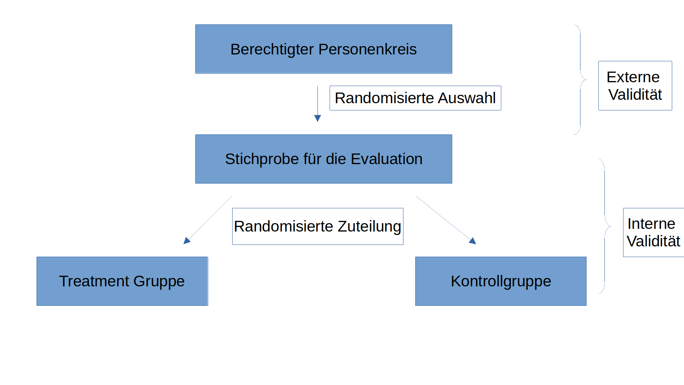

```{r setup, include=FALSE}
options(htmltools.dir.version = FALSE)
knitr::opts_chunk$set(warning = FALSE, message = FALSE, 
  comment = NA, dpi = 300,
  fig.align = "center", out.width = "70%", cache = FALSE)
library(knitr)
library(xaringan)
library(ggdag)
library(tidyverse)
library(skimr)
library(kableExtra)
library(broom)
library(forcats)
library(stargazer)
library(flipbookr)
library(modelsummary)

ggplot2::theme_set(theme_minimal())

```

## Warum sollten wir _randomisieren_?

Das Fundamentale Problem der _kausalen_ Inferenz:

- Auf individueller Ebene können keine kausalen Effekte beobachtet werden
- Es gibt keine individuellen Alternativszenarien (außer in "Zurück in die Zukunft")

.instructions[Dies bedeutet wir müssen uns durchschnittliche Effekte auf Gruppenebene anschauen!]

--

.alert[Wenn wir durchschnittliche Effekte zwischen Gruppen von Personen betrachten wollen, dann funktioniert dies nur, wenn die Gruppen die gleichen Eigenschaften haben.]

---

## Warum sollten wir _randomisieren_?

Mit einer ausreichend großen Stichprobe erhalten Sie durch Randomisierung Gruppen, die in ihren (pre-Treatment) Charakteristika gleich sind.

Übertragen auf ihr DAG bedeutet die Randomisierung: .alert[Confounder beeinflussen ihr Treatment nicht!]

--

.pull-left[

```{r confounding_fam1, echo=FALSE, fig.width=4.5, fig.height=3.35, out.width="100%"}
dagify(
  Y ~ X + Z,
  X ~ Z,
  coords = list(x = c(X = 1, Y = 3, Z = 2),
                y = c(X = 1, Y = 1, Z = 2)),
  exposure = "X",
  outcome = "Y",
  labels = c("X" = "Bildung", "Y" = "Einkommen",
             "Z" = "Familieneinkommen")
) %>% 
  tidy_dagitty() %>% 
  node_status() %>% 
  ggplot(aes(x = x, y = y, xend = xend, yend = yend)) +
  geom_dag_edges() +
  geom_dag_point(aes(color = status), size = 15) +
  geom_dag_text(color = "white", size = 5) +
  geom_dag_label_repel(aes(label = label), nudge_y = c(0.25, -0.25, 0.25)) +
  scale_color_manual(values = c("#FF4136", "#0074D9"),
                     na.value = "darkgreen") +
  guides(color = FALSE) +
  theme_dag()
```
]

--

.pull-right[
```{r confounding_fam2, echo=FALSE, fig.width=4.5, fig.height=3.35, out.width="100%"}
dagify(
  Y ~ X + Z,
  coords = list(x = c(X = 1, Y = 3, Z = 2),
                y = c(X = 1, Y = 1, Z = 2)),
  exposure = "X",
  outcome = "Y",
  labels = c("X" = "Bildung", "Y" = "Einkommen",
             "Z" = "Familieneinkommen")
) %>% 
  tidy_dagitty() %>% 
  node_status() %>% 
  ggplot(aes(x = x, y = y, xend = xend, yend = yend)) +
  geom_dag_edges() +
  geom_dag_point(aes(color = status), size = 15) +
  geom_dag_text(color = "white", size = 5) +
  geom_dag_label_repel(aes(label = label), nudge_y = c(0.25, -0.25, 0.25)) +
  scale_color_manual(values = c("#FF4136", "#0074D9"),
                     na.value = "darkgreen") +
  guides(color = FALSE) +
  theme_dag()
```
]

---

## Wie wird randomisiert?

```{r, echo = FALSE}

```

---

## Validität

**Interne Validität:** Misst ihre Methodik das was sie tatsächlich herausfinden wollen? D.h. können Sie die Änderung von Y _kausal_ auf die Änderung von X zurückführen?

**Externe Validität:** Lassen sich die Ergebnisse auch auf andere Datensätze übertragen/generalisieren?

--

.center[.instructions[Uns interessiert insbesondere die _interne Validität_ unserer Ergebnisse!]]

---

## Probleme für die interne Validität

- **Omitted Variables Bias**: Selbstselektion, Attrition (Schwund)
- **Trends in den Daten**: Reifung, Globale Trends, Saisonalität, Wiederholung, Regression zur Mitte
- **Kalibrierung der Studie**: Messfehler, Zeitrahmen
- **Kontamination**: Hawthorne, John Henry, Spillovers

---

## Ommitted Variable Bias

**Selbstselektion**
  - Problem: Personen können selbst entscheiden ob (oder wann) Sie an einem Programm teilnehmen oder nicht
  - Lösung: Randomisierung in Treatment und Kontrollgruppe und über die Zeit

**Attrition (Schwund)**
  - Problem: Personen die das Experiment verlassen sind unterschiedlich zu denen die bleiben
  - _Überprüfung_: Wie ähnlich sind die Personen die bleiben zu denen die gehen auf Basis beobachtbarer Charakteristika?
    
---

## Trends in den Daten

**Reifung**
  - Problem: Personen ändern sich alleine durch zunehmendes Alter zwischen zwei Messungen
  - Lösung: Kontrollgruppe verwenden um den Trend heraus rechnen zu können

**Globale Trends**
  - Problem: Globale Ereignisse können die Änderung in den Daten erklären
  - Lösung: Kontrollgruppe verwenden um den Trend heraus rechnen zu können

**Saisonalität**
  - Problem: Änderungen in den Daten basieren auf saisonalen Schwankungen
  - Lösung: Beobachtungen aus der gleichen Periode miteinander vergleichen

---

## Trends in den Daten

**Wiederholung**
  - Problem: Personen lernen natürlicherweise, wenn Sie immer den gleichen Fragen/Aufgaben ausgesetzt sind
  - Lösung: Tests verändern, Kontrollgruppen verwenden

**Regression zur Mitte**
  - Problem: Extreme Beobachtungen werden mit der Zeit weniger Extrem (Glück, Pech ...)
  - Lösung: Keine Ausreiser selektieren, Randomisierung

---

## Kalibrierung der Studie

**Falsche Messung**
  - Problem: Der Output wird nicht richtig gemessen
  - Lösung: Output muss richtig gemessen werden

**Zeitrahmen**
  - Problem: Studie ist zu kurz (oder zu lange) angelegt
  - Lösung: Richtigen Zeitrahmen anlegen


---

## Kontamination

**Hawthorne Effekt**
  - Problem: Personen verhalten sich unterscheidlich wenn diese beobachtet werden
  - Lösung: Versteckte Kontrollgruppen verwenden?

**John Henry Effekt**
  - Problem: Kontrollgruppe arbeitet sehr hart um zu zeigen das sie so gut wie die Treatment Gruppe sind
  - Lösung: Kontroll und Treatmentgruppe separat halten

**Spillover Effekt**
  - Problem: Kontrollgruppe lernt über die Zeit von der Treatment Gruppe
  - Lösung: Räumlich getrennte Kontrollgruppen verwenden


---

## Randomisiertes Experiment

.alert[Randomisierung löst viele Probleme der internen Validität!]

.question[Wie lassen sich die Ergebnisse eines Experiments interpretieren?]

--

Schritt 1: Untersuchen Sie ob die demographischen Faktoren und andere Charakteristika zwischen Treatment und Kontrollgruppe ähnlich sind (gebalanced)

Schritt 2: Untersuchen Sie die durchschnittlichen Differenzen im Ergebnis zwischen Treatment und Kontrollgruppe

---

## Experiment - Wochenbettdepressionen

.alert[Wir wollen uns einem Experiment zuwenden, dessen zeitliche Abfolge Sie hier sehen:]

```{r, echo = FALSE}
include_graphics("./figs/Experiment.png")
```

.small[Quelle: Baranov, Victoria, Sonia Bhalotra, Pietro Biroli, and Joanna Maselko. 2020. "Maternal Depression, Women's Empowerment, and Parental Investment: Evidence from a Randomized Controlled Trial." American Economic Review, 110 (3): 824-59.]

---

## Experiment - Wochenbettdepressionen

**Was sind Wochenbettdepressionen?**

**Postpartale Stimmungskrisen** (von lat. partus Geburt, Entbindung) beschreiben psychische Zustände oder Störungen, die in einem **zeitlichen Zusammenhang mit dem Wochenbett** auftreten (lat. post = nach; partus = Entbindung, Trennung).[1] Die Bandbreite der im Wochenbett auftretenden affektiven Zustände reicht von einer leichten Traurigkeit über Depressionen bis hin zu schweren psychotischen Erkrankungen.

Quelle: Wikipedia

--

.alert[Die Folgen einer Wochenbettdepression können langfristige Effekte auf die ganze Familie haben. Neben den negativen Folgen für die Gesundheit der Frau und des Kindes, verursachen Depressionen auch hohe wirtschaftliche Kosten.]

---

## Experiment - Wochenbettdepressionen

```{r, message = FALSE, warning=FALSE}
thp <- read_csv("../case-study/data/THP_clean.csv") 

thp %>%
  select(treat, depressed_1y, age_baseline, kids_no, first_child, employed_mo_baseline, MIL, maternalgma, edu_fa_baseline, employed_fa_baseline) %>%
  glimpse() 
```

---

## Schritt 1: Unterschiede untersuchen

`r chunk_reveal(chunk_name = "balancing")`

```{r balancing, include = F, message = T, eval=F}
thp %>% 
  filter(THP_sample==1) %>%
  select( treat, depressed_1y, age_baseline, kids_no, first_child, employed_mo_baseline, MIL, maternalgma, edu_fa_baseline, employed_fa_baseline) %>%
  pivot_longer(cols = -treat, names_to = "variable", values_to = "value") %>%
  group_nest(variable) %>%
  mutate(t.test = map(data, ~tidy(t.test(value ~ treat, data = .x)))) %>%
  unnest(t.test) %>%
  mutate( Mean_Treatment = round(estimate2, 2),
          Mean_Kontrolle = round(estimate1, 2),
    Differenz = -round(estimate, 2),
          Signifikanz = round(p.value,2)) %>%
  select( Mean_Treatment, Mean_Kontrolle, Differenz, Signifikanz) -> total

rownames(total) <- c("Alter der Mutter", "Depressiv (1 Jahr)", "Bildung des Vaters", "Vater beschäftigt", "Mutter beschäftigt", "Erstes Kind", "Anzahl der Kinder", "Oma im Haus", "Stiefoma im Haus")

total %>%
  kbl(col.names = c("Treatment", "Kontrolle","Differenz","p-Wert"), digits = 2, format = "html", 
      caption = "Balancing Tabelle für die Grundcharakteristika") %>%
  kable_styling(bootstrap_options = c("striped", "hover", "condensed", "responsive")) %>%
  kable_paper(full_width = F)  %>%
  add_header_above(c(" ", "Stichprobe Baseline (N = 903)" = 3)) %>%
  footnote(general = "Diese Tabelle testet, wie ausbalanciert die Beobachtungen in der Baseline Stichprobe sind. In den ersten beiden Spalten wird der Mittelwert für die Treatment bzw. Kontrollgruppe für die Baseline Stichprobe gezeigt. Spalte (3) zeigen die Differenz zwischen den Mittelwerten der Treatment und Kontrollgruppe für die jeweilige Stichprobe und die Spalte (4) zeigt die p-Werte und damit ob die einzelnen Mittelwerte statistisch signifikant unterschiedlich voneinander sind.") 
  
```


---

## Schritt 1: Unterschiede untersuchen

```{r, echo=FALSE, out.width='40%'}
#baseline sample
thp %>% 
  filter(THP_sample==1) %>%
  select( treat, depressed_1y, age_baseline, kids_no, first_child, employed_mo_baseline, MIL, maternalgma, edu_fa_baseline, employed_fa_baseline) %>%
  pivot_longer(cols = -treat, names_to = "variable", values_to = "value") %>%
  group_nest(variable) %>%
  mutate(t.test = map(data, ~tidy(t.test(value ~ treat, data = .x)))) %>%
  unnest(t.test) %>%
  mutate( Mean_Treatment = round(estimate2, 2),
          Mean_Kontrolle = round(estimate1, 2),
    Differenz = -round(estimate, 2),
          Signifikanz = round(p.value,2)) %>%
  select( Mean_Treatment, Mean_Kontrolle, Differenz, Signifikanz) -> total

rownames(total) <- c("Alter der Mutter", "Depressiv (1 Jahr)", "Bildung des Vaters", "Vater beschäftigt", "Mutter beschäftigt", "Erstes Kind", "Anzahl der Kinder", "Oma im Haus", "Stiefoma im Haus")

total %>%
  kbl(col.names = c("Treatment", "Kontrolle","Differenz","p-Wert"), digits = 2, format = "html", 
      caption = "Balancing Tabelle für die Grundcharakteristika") %>%
  kable_styling(bootstrap_options = c("striped", "hover", "condensed", "responsive")) %>%
  kable_paper(full_width = F)  %>%
  add_header_above(c(" ", "Stichprobe Baseline (N = 903)" = 3)) %>%
  footnote(general = "Diese Tabelle testet, wie ausbalanciert die Beobachtungen in der Baseline Stichprobe sind. In den ersten beiden Spalten wird der Mittelwert für die Treatment bzw. Kontrollgruppe für die Baseline Stichprobe gezeigt. Spalte (3) zeigen die Differenz zwischen den Mittelwerten der Treatment und Kontrollgruppe für die jeweilige Stichprobe und die Spalte (4) zeigt die p-Werte und damit ob die einzelnen Mittelwerte statistisch signifikant unterschiedlich voneinander sind.") 
```

---

## Schritt 1: Unterschiede untersuchen

**Wann nutzt uns eine solche Balancing Tabelle?**

Wir sollten eine solche Tabelle immer dann erstellen, wenn wir uns nicht ganz sicher sein können, ob unsere Randomisierung erfolgreich war, d.h. insbesondere bei der Untersuchung von Feldexperimenten. 

- Wenn wir die Randomisierung nicht selbst durchgeführt haben, insbesondere in Feldexperimenten
- Bei _Attrition_, d.h. Schwund bei den Teilnehmern des Experiments

---

## Schritt 1: Unterschiede untersuchen

.question[Was lernen wir aus der Balancing Tabelle?]

Aus dieser Balancing Tabelle lernen wir mehrere Dinge:

- In den meisten Grundcharakteristika unterscheiden sich Treatment und Kontrollgruppe **nicht** voneinander.
- Einige Variablen sind jedoch signifikant unterschiedlich zwischen Treatment und Kontrollgruppe, insbesondere ob die Oma väterlicherseits oder mütterlicherseits mit im Haushalt lebt.
- Wir verlieren einige Teilnehmer über die Zeit (903 -> 704 -> 585 Beobachtungen), d.h. wir haben nach 7 Jahren nur noch 64,8% der Mütter, die ursprünglich am Experiment teilgenommen haben, in der Stichprobe.

---

## Schritt 2: Durchschnittliche Differenzen

`r chunk_reveal(chunk_name = "depressionen")`

```{r depressionen, include = F, message = T, eval=F}
thp %>%
  select(treat, depressed_6m, depressed_1y, depressed) %>%
  mutate(Baseline = 1) %>%
  pivot_longer( cols = -treat, names_to = "name", values_to = "depression") %>%
  mutate(name = fct_relevel(name, "Baseline", "depressed_6m", "depressed_1y", "depressed"),
         name = fct_recode(name,
                           "6 Monate" = "depressed_6m",
                           "1 Jahr" = "depressed_1y",
                           "7 Jahre" = "depressed"),
         treat_factor = as.factor(ifelse(treat == 1, "Treatment", "Kontrolle"))) %>%
  ggplot(aes(x = name, y = depression, 
             color = treat_factor)) +
  scale_color_manual(values = c("#D55E00", "#0072B2")) +
  stat_summary(geom = "pointrange", 
               fun.data = "mean_se", 
               fun.args = list(mult=2.33)) +
  ylim(0,1) +
  theme_minimal() +
  theme(legend.title = element_blank(),
        legend.position = "bottom") +
  labs(x = NULL, 
       y = "Anteil an Depressionen",
       title = "Treatment Effekte auf den Anteil an Depressionen",
       caption = "Gezeigt wird der Mittelwert der Gruppen inklusive des 99% Konfidenzintervalls.\nEigene Analysen auf Basis von Baranov et al. (2020)") 

```

---

## Schritt 2: Durchschnittliche Differenzen

.pull-left[
```{r, echo = F}
thp %>%
  select(treat, depressed_6m, depressed_1y, depressed) %>%
  mutate(Baseline = 1) %>%
  pivot_longer( cols = -treat, names_to = "name", values_to = "depression") %>%
  mutate(name = fct_relevel(name, "Baseline", "depressed_6m", "depressed_1y", "depressed"),
         name = fct_recode(name,
                           "6 Monate" = "depressed_6m",
                           "1 Jahr" = "depressed_1y",
                           "7 Jahre" = "depressed"),
         treat_factor = as.factor(ifelse(treat == 1, "Treatment", "Kontrolle"))) %>%
  ggplot(aes(x = name, y = depression, 
             color = treat_factor)) +
  scale_color_manual(values = c("#D55E00", "#0072B2")) +
  stat_summary(geom = "pointrange", 
               fun.data = "mean_se", 
               fun.args = list(mult=2.33)) +
  ylim(0,1) +
  theme_minimal() +
  theme(legend.title = element_blank(),
        legend.position = "bottom") +
  labs(x = NULL, 
       y = "Anteil an Depressionen",
       title = "Treatment Effekte auf den Anteil an Depressionen",
       caption = "Gezeigt wird der Mittelwert der Gruppen inklusive des 99% Konfidenzintervalls.\nEigene Analysen auf Basis von Baranov et al. (2020)") 

```
]

.pull-right[
- Die Treatmentgruppe hat einen sehr raschen Rückgang bei den Depressionen
    - Bereits nach 6 Monaten auf rund 25%
    - Stagniert auf rund 25% auch nach einem Jahr
    - Geht zurück auf unter 20% nach sieben Jahren
- Die Kontrollgruppe verzeichnet auch einen starken Rückgang der Depressionen 
    - Nach 6 Monaten auf etwas mehr als 50%
    - Stagniert bei etwas über 50% auch nach einem Jahr
    - Geht zurück auf rund 25% nach sieben Jahren
]

--

.alert[Ein naiver Vergleich nur innerhalb der Treatmentgruppe vorher/nachher würde den Effekt des Treatments stark überschätzen!]

---

class: inverse, center, middle

# Regressionsanalysen

---

## Schritt 2: Durchschnittliche Differenzen

`r chunk_reveal(chunk_name = "diffs")`

```{r diffs, include = F, message = T, eval=F}
thp %>%
  filter(attrit2 == 0 & THP_sample == 1) %>%
  group_by(treat) %>%
  summarize( dep6m_avg = round(mean(depressed_6m, na.rm = T), 3)) -> dep1

thp %>%
  filter(attrit2 == 0 & THP_sample == 1) %>%
  group_by(treat) %>%
  summarize( depressed_1y = round(mean(depressed_1y, na.rm = T), 3)) -> dep2

thp %>%
  filter(attrit2 == 0 & THP_sample == 1) %>%
  group_by(treat) %>%
  summarize( depressed_avg = round(mean(depressed, na.rm = T), 3)) -> dep3

dep1 %>%
  bind_rows(dep2) %>%
  bind_rows(dep3) %>%
  pivot_longer(cols = -treat, names_to = "depression", values_to = "value"  ) %>%
  filter( !is.na(value) ) %>%
  pivot_wider( names_from = depression, values_from = value) %>%
  kbl(col.names = c("Treatment", "6 Monate","1 Jahr","7 Jahre"), digits = 3, format = "html") %>%
  kable_styling(bootstrap_options = c("striped", "hover", "condensed", "responsive")) %>%
  kable_paper(full_width = F)  %>%
  add_header_above(c(" ", "Anteil an Depressionen" = 3))
```


---

## Schritt 2: Durchschnittliche Differenzen

```{r echo = F}
thp %>%
  filter(attrit2 == 0 & THP_sample == 1) %>%
  group_by(treat) %>%
  summarize( dep6m_avg = round(mean(depressed_6m, na.rm = T), 3)) -> dep1

thp %>%
  filter(attrit2 == 0 & THP_sample == 1) %>%
  group_by(treat) %>%
  summarize( depressed_1y = round(mean(depressed_1y, na.rm = T), 3)) -> dep2

thp %>%
  filter(attrit2 == 0 & THP_sample == 1) %>%
  group_by(treat) %>%
  summarize( depressed_avg = round(mean(depressed, na.rm = T), 3)) -> dep3

dep1 %>%
  bind_rows(dep2) %>%
  bind_rows(dep3) %>%
  pivot_longer(cols = -treat, names_to = "depression", values_to = "value"  ) %>%
  filter( !is.na(value) ) %>%
  pivot_wider( names_from = depression, values_from = value) %>%
  kbl(col.names = c("Treatment", "6 Monate","1 Jahr","7 Jahre"), digits = 3, format = "html") %>%
  kable_styling(bootstrap_options = c("striped", "hover", "condensed", "responsive")) %>%
  kable_paper(full_width = F)  %>%
  add_header_above(c(" ", "Anteil an Depressionen" = 3))
```

---

## Schritt 2: Durchschnittliche Differenzen

```{r, eval =F}
reg_dep6m <- lm(depressed_6m ~ treat, data = filter(thp, attrit2 == 0 & THP_sample == 1))
reg_dep6m_long <- lm(depressed_6m ~ treat + age_baseline + age_baseline_sq + employed_mo_baseline + mo_emp + grandmother_baseline + MIL + wealth_baseline + edu_lvl_mo_1 + edu_lvl_mo_2 + edu_lvl_mo_3 + edu_mo_baseline + edu_fa_baseline + kids_no + first_child + hamd_baseline + mspss_baseline + month_int + month_int_sq + doi0 + intervr_1 + intervr_2 + intervr_3 +intervr_4 + intervr_5 + intervr_6 + intervr_7 + intervr_8 + intervr_9, data = filter(thp, attrit2 == 0 & THP_sample == 1))

reg_dep1y <- lm(depressed_1y ~ treat, data =  filter(thp, attrit2 == 0 & THP_sample == 1))
reg_dep1y_long <- lm(depressed_1y ~ treat + age_baseline + age_baseline_sq + employed_mo_baseline + mo_emp + grandmother_baseline + MIL + wealth_baseline + edu_lvl_mo_1 + edu_lvl_mo_2 + edu_lvl_mo_3 + edu_mo_baseline + edu_fa_baseline + kids_no + first_child + hamd_baseline + mspss_baseline + month_int + month_int_sq + doi0 + intervr_1 + intervr_2 + intervr_3 +intervr_4 + intervr_5 + intervr_6 + intervr_7 + intervr_8 + intervr_9, data = filter(thp, attrit2 == 0 & THP_sample == 1))

reg_dep7y <- lm(depressed ~ treat, data = filter(thp, attrit2 == 0 & THP_sample == 1))
reg_dep7y_long <- lm(depressed ~ treat + age_baseline + age_baseline_sq + employed_mo_baseline + mo_emp + grandmother_baseline + MIL + wealth_baseline + edu_lvl_mo_1 + edu_lvl_mo_2 + edu_lvl_mo_3 + edu_mo_baseline + edu_fa_baseline + kids_no + first_child + hamd_baseline + mspss_baseline + month_int + month_int_sq + doi0 + intervr_1 + intervr_2 + intervr_3 +intervr_4 + intervr_5 + intervr_6 + intervr_7 + intervr_8 + intervr_9, data = filter(thp, attrit2 == 0 & THP_sample == 1))

rows <- tribble(~term,          ~reg_dep6m,  ~reg_dep6m_long, ~reg_dep1y, ~reg_dep1y_long, ~reg_dep7y, ~reg_dep7y_long,
                "Kontrollvariablen", "Nein", "Ja", "Nein", "Ja", "Nein", "Ja")

attr(rows, 'position') <- c(3)

modelsummary(list(reg_dep6m, reg_dep6m_long, reg_dep1y, reg_dep1y_long, reg_dep7y, reg_dep7y_long), 
          type = "html",
          covariate.labels = c("Treatment"),
          keep = "treat",
          add_rows = rows,
          stars = c('*' = .1, '**' = 0.05, '***' = .01),
          gof_omit = 'DF|Deviance|RMSE|AIC|BIC|Log.Lik',
          add.lines = list(c("Kontrollvariablen", "Nein", "Ja", "Nein", "Ja", "Nein", "Ja")),
          title = "Depression bei Müttern, mit und ohne Kontrollvariablen") %>%
          add_header_above(c(" " = 1,"Nach 6 Monaten" = 2, "Nach 1 Jahr" = 2, "Nach 7 Jahren" = 2))
```

---


## Schritt 2: Durchschnittliche Differenzen

```{r, echo =F, results = 'asis'}
reg_dep6m <- lm(depressed_6m ~ treat, data = filter(thp, attrit2 == 0 & THP_sample == 1))
reg_dep6m_long <- lm(depressed_6m ~ treat + age_baseline + age_baseline_sq + employed_mo_baseline + mo_emp + grandmother_baseline + MIL + wealth_baseline + edu_lvl_mo_1 + edu_lvl_mo_2 + edu_lvl_mo_3 + edu_mo_baseline + edu_fa_baseline + kids_no + first_child + hamd_baseline + mspss_baseline + month_int + month_int_sq + doi0 + intervr_1 + intervr_2 + intervr_3 +intervr_4 + intervr_5 + intervr_6 + intervr_7 + intervr_8 + intervr_9, data = filter(thp, attrit2 == 0 & THP_sample == 1))

reg_dep1y <- lm(depressed_1y ~ treat, data =  filter(thp, attrit2 == 0 & THP_sample == 1))
reg_dep1y_long <- lm(depressed_1y ~ treat + age_baseline + age_baseline_sq + employed_mo_baseline + mo_emp + grandmother_baseline + MIL + wealth_baseline + edu_lvl_mo_1 + edu_lvl_mo_2 + edu_lvl_mo_3 + edu_mo_baseline + edu_fa_baseline + kids_no + first_child + hamd_baseline + mspss_baseline + month_int + month_int_sq + doi0 + intervr_1 + intervr_2 + intervr_3 +intervr_4 + intervr_5 + intervr_6 + intervr_7 + intervr_8 + intervr_9, data = filter(thp, attrit2 == 0 & THP_sample == 1))

reg_dep7y <- lm(depressed ~ treat, data = filter(thp, attrit2 == 0 & THP_sample == 1))
reg_dep7y_long <- lm(depressed ~ treat + age_baseline + age_baseline_sq + employed_mo_baseline + mo_emp + grandmother_baseline + MIL + wealth_baseline + edu_lvl_mo_1 + edu_lvl_mo_2 + edu_lvl_mo_3 + edu_mo_baseline + edu_fa_baseline + kids_no + first_child + hamd_baseline + mspss_baseline + month_int + month_int_sq + doi0 + intervr_1 + intervr_2 + intervr_3 +intervr_4 + intervr_5 + intervr_6 + intervr_7 + intervr_8 + intervr_9, data = filter(thp, attrit2 == 0 & THP_sample == 1))

rows <- tribble(~term,          ~reg_dep6m,  ~reg_dep6m_long, ~reg_dep1y, ~reg_dep1y_long, ~reg_dep7y, ~reg_dep7y_long,
                "Kontrollvariablen", "Nein", "Ja", "Nein", "Ja", "Nein", "Ja")

attr(rows, 'position') <- c(3)

modelsummary(list(reg_dep6m, reg_dep6m_long, reg_dep1y, reg_dep1y_long, reg_dep7y, reg_dep7y_long), 
          type = "html",
          coef_rename = c("treat" = "Treatment"),
          keep = "treat",
          add_rows = rows,
          stars = c('*' = .1, '**' = 0.05, '***' = .01),
          gof_omit = 'DF|Deviance|RMSE|AIC|BIC|Log.Lik|F',
          title = "Depression bei Müttern, mit und ohne Kontrollvariablen") %>%
          add_header_above(c(" " = 1,"Nach 6 Monaten" = 2, "Nach 1 Jahr" = 2, "Nach 7 Jahren" = 2))
```

---

### Gegenüberstellung der durchschnittlichen Differenzen

```{r, echo = F}
dep1 %>%
  bind_rows(dep2) %>%
  bind_rows(dep3) %>%
  pivot_longer(cols = -treat, names_to = "depression", values_to = "value"  ) %>%
  filter( !is.na(value) ) %>%
  pivot_wider( names_from = depression, values_from = value) %>%
  kbl(col.names = c("Treatment", "6 Monate","1 Jahr","7 Jahre"), digits = 3, format = "html") %>%
  kable_styling(bootstrap_options = c("striped", "hover", "condensed", "responsive")) %>%
  kable_paper(full_width = F)  %>%
  add_header_above(c(" ", "Anteil an Depressionen" = 3))
```

--- 

```{r, echo=F, results='asis', out.width='70%'}
modelsummary(list(reg_dep6m, reg_dep6m_long, reg_dep1y, reg_dep1y_long, reg_dep7y, reg_dep7y_long), 
          type = "html",
          coef_rename = c("treat" = "Treatment"),
          keep = "treat",
          add_rows = rows,
          stars = c('*' = .1, '**' = 0.05, '***' = .01),
          gof_omit = 'DF|Deviance|RMSE|AIC|BIC|Log.Lik|F',
          title = "Depression bei Müttern, mit und ohne Kontrollvariablen") %>%
          add_header_above(c(" " = 1,"Nach 6 Monaten" = 2, "Nach 1 Jahr" = 2, "Nach 7 Jahren" = 2))
```

---

## Schritt 2: Durchschnittliche Differenzen

.question[Sollten wir für irgendwelche Variablen kontrollieren?]

--

.alert[Nein, wir sollten für nichts kontrollieren!]

Alle Pfeile in das Treatment wurden im DAG gelöscht, daher gibt es auch theoretisch keine Confounder auf die wir kontrollieren müssten.

---

## Schritt 2: Durchschnittliche Differenzen

`r chunk_reveal(chunk_name = "financial")`

```{r financial, include = F, message = T, eval=F}

reg_financial <- lm(motherfinancial ~ treat, data = filter(thp, attrit2 == 0 & THP_sample == 1)) 
reg_money <- lm(parentmoney ~ treat, data = filter(thp, attrit2 == 0 & THP_sample == 1))
reg_time<- lm(parenttime ~ treat, data = filter(thp, attrit2 == 0 & THP_sample == 1))
reg_style <- lm(parentstyle ~ treat, data = filter(thp, attrit2 == 0 & THP_sample == 1))
reg_fertility <- lm(fertility_vars ~ treat, data = filter(thp, attrit2 == 0 & THP_sample == 1))


tidy(reg_financial, conf.int = T) %>%
  mutate(term = ifelse( term == "treat", "fin_emp", term))%>%
  bind_rows(tidy(reg_money, conf.int = T)) %>%
  mutate(term = ifelse( term == "treat", "money", term)) %>%
  bind_rows(tidy(reg_time, conf.int = T)) %>%
  mutate(term = ifelse( term == "treat", "time", term)) %>%
  bind_rows(tidy(reg_style, conf.int = T)) %>%
  mutate(term = ifelse( term == "treat", "style", term)) %>%
  bind_rows(tidy(reg_fertility, conf.int = T)) %>%
  mutate(term = ifelse( term == "treat", "fertility", term)) %>%
  filter( term != "(Intercept)") %>%
    mutate(term = fct_relevel(term, "fertility", "style", "time", "money", "fin_emp"),
           term = fct_recode(term,
                           "Finanzielle Stärkung" = "fin_emp",
                           "Monetäre Investments" = "money",
                           "Zeitliche Investments" = "time",
                           "Erziehungsstil" = "style",
                           "Fruchtbarkeit" = "fertility")) %>%
  ggplot(aes(x = term, y=estimate, ymin=conf.low, ymax=conf.high)) +
  geom_pointrange() +
  geom_hline(yintercept = 0, col = "orange") +
  scale_y_continuous(breaks = c(-0.25,0,0.25,0.5)) +
  coord_flip() +
  labs(
    x = NULL, y = "Effektgröße als Standardabweichung der Kontrollgruppe",
    title = "Effekt der Intervention auf ökonomische Entscheidungen der Mutter", 
    subtitle = "95% Konfidenzintervall um den Punktschätzer"
    ) +
  theme_minimal()
```

---

## Schritt 2: Durchschnittliche Differenzen

```{r, echo=F, out.width='40%'}

reg_financial <- lm(motherfinancial ~ treat, data = filter(thp, attrit2 == 0 & THP_sample == 1)) 
reg_money <- lm(parentmoney ~ treat, data = filter(thp, attrit2 == 0 & THP_sample == 1))
reg_time<- lm(parenttime ~ treat, data = filter(thp, attrit2 == 0 & THP_sample == 1))
reg_style <- lm(parentstyle ~ treat, data = filter(thp, attrit2 == 0 & THP_sample == 1))
reg_fertility <- lm(fertility_vars ~ treat, data = filter(thp, attrit2 == 0 & THP_sample == 1))


tidy(reg_financial, conf.int = T) %>%
  mutate(term = ifelse( term == "treat", "fin_emp", term))%>%
  bind_rows(tidy(reg_money, conf.int = T)) %>%
  mutate(term = ifelse( term == "treat", "money", term)) %>%
  bind_rows(tidy(reg_time, conf.int = T)) %>%
  mutate(term = ifelse( term == "treat", "time", term)) %>%
  bind_rows(tidy(reg_style, conf.int = T)) %>%
  mutate(term = ifelse( term == "treat", "style", term)) %>%
  bind_rows(tidy(reg_fertility, conf.int = T)) %>%
  mutate(term = ifelse( term == "treat", "fertility", term)) %>%
  filter( term != "(Intercept)") %>%
    mutate(term = fct_relevel(term, "fertility", "style", "time", "money", "fin_emp"),
           term = fct_recode(term,
                           "Finanzielle Stärkung" = "fin_emp",
                           "Monetäre Investments" = "money",
                           "Zeitliche Investments" = "time",
                           "Erziehungsstil" = "style",
                           "Fruchtbarkeit" = "fertility")) %>%
  ggplot(aes(x = term, y=estimate, ymin=conf.low, ymax=conf.high)) +
  geom_pointrange() +
  geom_hline(yintercept = 0, col = "orange") +
  scale_y_continuous(breaks = c(-0.25,0,0.25,0.5)) +
  coord_flip() +
  labs(
    x = NULL, y = "Effektgröße als Standardabweichung der Kontrollgruppe",
    title = "Effekt der Intervention auf ökonomische Entscheidungen der Mutter", 
    subtitle = "95% Konfidenzintervall um den Punktschätzer"
    ) +
  theme_minimal()
```

---

## Experimente als "Goldstandard"?

Oft werden Experimente als "Goldstandard" für die kausale Inferenz betrachtet.

--

.instructions[Experimente sind sehr schön!]

.alert[Doch Experimente sind meist sehr schwer durchzuführen und in manchen Situationen gar nicht denkbar!]

--

> Was uns interessiert sind kausale Effekte zu messen und dafür sind Experimente eine wichtige Säule, aber nicht die einzige Möglichkeit!

---

## Experimente und interne Validität

Experimente können sehr viele Probleme bzgl. interner Validität lösen

- Selektion
    - Treatment und Kontrollgruppen sind vergleichbar
    - Keine Selbstselektion
- Trends
    - Keine Saisonalität
    - Keine Regression zur Mitte

---

## Experimente und interne Validität

.instructions[**Jedoch:** Experimente können nicht das Problem der _Attrition_ beheben!]

Wenn Attrition mit dem Treatment korreliert ist haben wir ein Problem

Genauer: Wenn Personen selektiv aufhören an der Studie teilzunehmen, in Abhängigkeit davon ob sie getreatet wurden oder nicht, dann hilft uns auch ein sehr schön designtes Experiment nicht weiter.

---

## Experimente und interne Validität

Für unser Experiment:

- Nach 7 Jahren hatten die Autoren noch eine Befragung der Frauen durchgeführt
- Wenn die Attrition in der Treatment und Kontrollgruppen über diese 7 Jahre hinweg unterschiedlich war und nun z.B. doppelt so viele Frauen aus der Kontrollgruppe in der Stichprobe sind, dann wäre die Attrition mit dem Treatment Status korreliert und unsere Aussagen nicht mehr valide

---

## Experimente und interne Validität

```{r, echo=FALSE}
#baseline sample
total <- thp %>% 
  filter(attrit2 == 0 & THP_sample == 1) %>%
  select( treat, depressed_1y, age_baseline, kids_no, first_child, employed_mo_baseline, MIL, maternalgma, edu_fa_baseline, employed_fa_baseline ) %>%
  pivot_longer(cols = -treat, names_to = "variable", values_to = "value") %>%
  group_nest(variable) %>%
  mutate(t.test = map(data, ~tidy(t.test(value ~ treat, data = .x)))) %>%
  unnest(t.test) %>%
  mutate( Mean_Treatment = round(estimate2, 2),
          Mean_Kontrolle = round(estimate1, 2),
          Differenz = -round(estimate, 2),
          Signifikanz = round(p.value,2)) %>%
  select(Mean_Treatment, Mean_Kontrolle, Differenz, Signifikanz) %>%
  mutate( Name = c("Stiefoma im Haus", "Alter der Mutter", "Depressiv (1 Jahr)", "Bildung des Vaters", "Vater beschäftigt", "Mutter beschäftigt", "Erstes Kind", "Anzahl der Kinder", "Oma im Haus"))

column_to_rownames(total, var = "Name") %>% 
  kbl(col.names = c("Treatment", "Kontrolle","Differenz","p-Wert"), digits = 2, format = "html", 
      caption = "Balancing Tabelle für die Grundcharakteristika") %>%
  kable_styling(bootstrap_options = c("striped", "hover", "condensed", "responsive")) %>%
  kable_paper(full_width = F)  %>%
  add_header_above(c(" ", "Stichprobe Baseline (N = 585)" = 4)) %>%
  footnote(general = "Diese Tabelle testet, wie ausbalanciert die Beobachtungen in der Stichprobe nach 7 Jahren sind. In den ersten beiden Spalten wird der Mittelwert für die Treatment bzw. Kontrollgruppe für die Stichprobe nach 7 Jahren gezeigt. Spalte (3) zeigen die Differenz zwischen den Mittelwerten der Treatment und Kontrollgruppe für die jeweilige Stichprobe und die Spalte (4) zeigt die p-Werte und damit ob die einzelnen Mittelwerte statistisch signifikant unterschiedlich voneinander sind.") 
```


---

## Experimente und interne Validität

Es ist wichtig auf Attrition zu achten:
  - Versuchen Sie so viele Charakteristika über ihre Teilnehmer zu bekommen wie möglich
  - Untersuchen Sie anhand dieser Charakteristika ob die Attrition zwischen den zwei Gruppen zufällig war
  - Versuchen Sie das Committment ihrer Teilnehmer am Experiment so hoch wie möglich zu halten
  
Ein weiteres Problem des Experiments könnte sein, das die Teilnehmer sich nicht an das halten, was sie vorgeben:
  - Manche Teilnehmer der Treatment Gruppe werden das Treatment einfach nicht nehmen
  - Manche Teilnehmer der Kontrollgruppe werden eventuell doch an das Treatment kommen
  