```{r setup, include=FALSE}
options(htmltools.dir.version = FALSE)
knitr::opts_chunk$set(warning = FALSE, message = FALSE, 
  comment = NA, dpi = 300,
  fig.align = "center", out.width = "70%", cache = FALSE)
library(tidyverse)
library(here)
library(knitr)
#library(emo)
library(extrafont)
library(png) 
library(xaringan)

ggplot2::theme_set(theme_minimal())
```


## Warum Git und Github?

- **Code teilen:** Durch Github können Sie einfach ihre Arbeit mit anderen teilen. Auch ihrem späteren Arbeitgeber können Sie so zeigen, was Sie können
- **Zusammenarbeit:** Wenn Sie ein zentrales Repositorium auf Github haben dann können viele Personen gleichzeitig an dem Projekt arbeiten. Dadurch ist jeder auf dem aktuellsten Stand. Durch sogenannte Pull-Requests können Anmerkungen gesendet werden, welche Änderungen am Code vorsehen. Sie können dann diese Anfragen annehmen oder ablehnen.
- **Versionskontrolle:** Das Beste an Git ist dessen Versionierungsfähigkeit von unterschiedlichsten Dokumenten. Sie können jede beliebige Datei so oft speichern wie Sie möchten und immer wieder zu einem alten Speicherstand zurückkehren, falls Sie dies wünschen. Sie können auch sogenannte "branches" kreieren, bei denen Sie sich austoben und Dinge ausprobieren können und diese nachher zu "Main" zumergen.

---

class: center, middle, inverse

# Installation von Git 

---

## Installation auf dem Mac

- Öffnen Sie ein Terminal (Utilities -> Application -> Terminal)
- Haben Sie git bereits installiert?

> git --version

- Falls Sie git nicht installiert haben holen Sie dies bitte nach

---

## Installation unter Windows

- Navigieren Sie zu [https://git-scm.com/downloads](https://git-scm.com/downloads) und laden Sie die aktuellste Version herunter
- Wählen Sie als Default Editor "Notepad ++" (falls bei ihnen installiert) oder "nano" aus
- Wählen Sie _Git and optional Unix tools from the Windows Command Prompt_ bei der Installation, ansonsten die Default Einstellungen

---

## Das Terminal in RStudio öffnen

In RStudio:

- Tools > Global Options > Terminal
- Aus dem Drop-Down "Git-Bash" auswählen

Testen ob Bash nun das neue Terminal ist:
- Tools > Terminal > New Terminal

---

class: center, middle, inverse

# Git

---

## Quellen

Eine sehr gute Einführung in Git mit RStudio können Sie hier finden:
https://rafalab.github.io/dsbook/git.html

Diese Präsentation baut auf diesem Buch auf:

Irizarry, R. A. (2019). Introduction to data science: data analysis and prediction algorithms with R.

--

Weiterführende und tiefergehende Einblicke erhalten sie bei diesen Quellen:

- Codeacademy: https://www.codecademy.com/learn/learn-git
- GitHub Guides: https://guides.github.com/activities/hello-world/
- Try Git tutorial: https://try.github.io/levels/1/challenges/1
- Happy Git and GitHub for the useR: http://happygitwithr.com/


---

## Git und Github verbinden

- Nun können Sie ein Repositorium auf Github erzeugen
- Das Repositorium auf Github ist das sogenannte "Main", bildet also die Basis für alle Projektteilnehmer

.instructions[Erstellen Sie ein neues Repositorium auf Github!]

---

## Git und Github verbinden

- Loggen Sie sich in Github ein
- Klicken Sie auf "New"-Button
- Benennen Sie dieses Repo mit "First_Repo"
    - Erstellen Sie hier ein "Public"-Repo
    - Falls Sie private Repos erstellen möchten, dann können Sie dies tun, dafür müssen Sie sich nur als Student bei Github registrieren (es reicht ein Foto ihres Studentenausweises!)
    - Mehr Infos zum Studentenrabatt erfahren Sie hier: https://education.github.com/discount_requests/new
- _Clonen_ Sie sich ihr Repo ( Link _Clone with HTTPS_ speichern )
    - Links abspeichern, benötigen wir später!
    - Beispiel für mein "First_Repo": https://github.com/AlexRieber/First_repo.git

---

```{r, echo=FALSE}
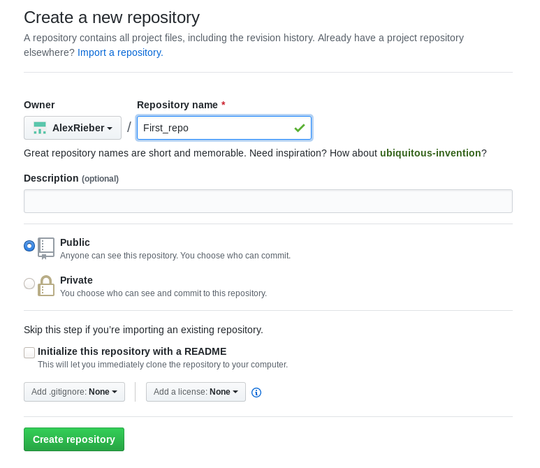
```

---

## Git Commands

Es gibt sehr viele Aktionen, welche Sie mit Git machen können, wir wollen uns hier auf die vier Hauptaktionen konzentrieren:

- **pull**: Sie importieren (pull) Änderungen von dem _remote_ Repositorium (aka von Github)
- **add**: Fügen Sie Dateien hinzu, dazu wird auch _stage_ gesagt
- **commit**: Änderungen an ihrem _lokalen_ Repositorium
- **push**: Überträgt die lokal gemachten Änderungen an das _remote_ Repositorium

```{r, echo=FALSE}
include_graphics("figs/git-layout.png")
```

.small[Quelle: https://rafalab.github.io/dsbook/git.html]

---

## Clone

- Sie können ein _Upstream Repository_ auf Github klonen
    - Es wird die komplette Struktur geklont
    - Wir können bspw. das RTutor Repositorium klonen
    - Der Link hierzu: https://github.com/skranz/RTutor.git
    
```{r, echo=FALSE}
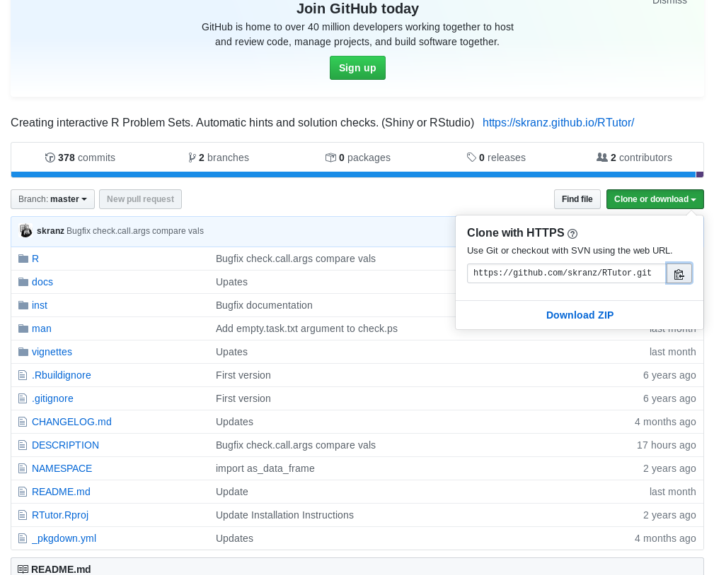
```   
.small[Quelle: https://rafalab.github.io/dsbook/git.html]

---

## Clone

.alert[Achtung Advanced: Siehe hierzu die Einführungsvideos zu Repositories klonen mit Github Desktop!]

Hier ein Beispiel wie Sie das Klonen von der Kommandozeile aus tätigen:

```{bash, eval=FALSE}
pwd
mkdir git-example
cd git-example
git clone https://github.com/skranz/RTutor.git
cd RTutor
```

Ein intuitiver GUI für alle Aktionen auf Github ist Github Desktop.

---

## Clone

- Sie haben soeben das komplette RTutor Repositorium auf ihren PC geklont!
- Das _Working Directory_ ist ihr aktuelles Verzeichnis
- Änderungen erfolgen immer _nur_ in ihrem aktuellen Verzeichnis!
```{r, echo=FALSE}
include_graphics("figs/git-clone.png")
```
.small[Quelle: https://rafalab.github.io/dsbook/git.html]

---

## Status

- Mit `git status` können Sie überprüfen, wie ihr aktueller Status ist über alle _areas_ ist
- Haben Sie bereits Dateien geändert und müssen diese noch _committed_ werden?
```{r, echo=FALSE}
include_graphics("figs/git-status.png")
```
.small[Quelle: https://rafalab.github.io/dsbook/git.html]

---

## Dateien hinzufügen

- Änderungen die Sie an Dateien vornehmen wollen Sie tracken und versioniert sehen
- **Doch:** Nicht jede kleinste Änderung soll in Github landen.
    - In der Regel wollen Sie nur Änderungen mit Github synchronisieren welche es auch wert sind
- Wenn Sie Änderungen in der _Staging area_, dann sind diese noch nicht in der Versionierung!

**Beispiel:** Hinzufügen einer Datei zu unserem Repositorium. Z.B. einer leeren Daten mit dem Namen `Neu.txt`


---

## Stage

```{r, echo=FALSE}
include_graphics("figs/git-add.png")
```
.small[Quelle: https://rafalab.github.io/dsbook/git.html]

Diese neue Datei können wir nun zu unserer _Staging area_ hinzufügen:

> git add Neu.txt

> git status


---

## Commit

Nun müssen Sie die neue Datei noch zu ihrem _lokalen Repositorium_ hinzufügen, dies machen Sie mit `git commit`

- Sie sollten zu jedem Commit eine möglichst aussagekräftige Beschreibung dessen was Sie gemacht haben hinzufügen

> git commit -m "Hinzufuegen einer neuen Datei"

--

Sie haben nun ihr _lokales Repositorium_ geändert, dies können Sie mit `git status` nachvollziehen

```{r, echo=FALSE}
include_graphics("figs/git-commit.png")
```
.small[Quelle: https://rafalab.github.io/dsbook/git.html]

> git status


---

## Änderungen nachverfolgen

Wenn Sie nun ihre Datei ändern, dann tun Sie dies wieder nur in ihrem aktuellen Verzeichnis, d.h. dem _Working Directory_

.instructions[Änderungen müssen wieder committed werden!]

--

> echo "Eine zusaetzliche Zeile hinzufuegen" >> Neu.txt

> git commit -m "Kleinere Aenderungen bei Neu.txt" Neu.txt

--

Mit dem Befehl `git log` können Sie Änderungen an ihrer Datei _Neu.txt_ nachverfolgen:

> git log Neu.txt

---

## Push

Im letzten Schritt sollten Sie ihre Änderungen zu ihrem _remote Repositorium_ **pushen**:

> git push

.alert[Dies wird jedoch hier nicht funktionieren, da Sie nicht Eigentümer des Repositoriums sind!]

```{r, echo=FALSE}
include_graphics("figs/git-push.png")
```
.small[Quelle: https://rafalab.github.io/dsbook/git.html]

---

## Pull

Das _remote Repositorium_ wird sich über die Zeit verändern, wenn mehrere Personen daran arbeiten.
Sie sollten **immer**, d.h. jedes mal wenn Sie beginnen an ihrem Projekt zu arbeiten (z.B. jeden morgen) Änderungen vom _remote Repositorium_ **pullen**

> git-pull

```{r, echo=FALSE}
include_graphics("figs/git-pull.png")
```
.small[Quelle: https://rafalab.github.io/dsbook/git.html]

---

class: center, middle, inverse

# Initialisierung eines Repositoriums

---

## Ein neues Repositorium erstellen

Bei eigenen Projekten außerhalb des Projektkurses haben Sie i.d.R. kein Github Repositorium, welches Sie klonen können.
Deshalb hier noch kurz erklärt, wie Sie ein lokales Repositorium mit git und github synchen können.

.instructions[Erstellen Sie ein Repositorium mit dem Namen `Testrepo`]

--

```{r, echo=FALSE}
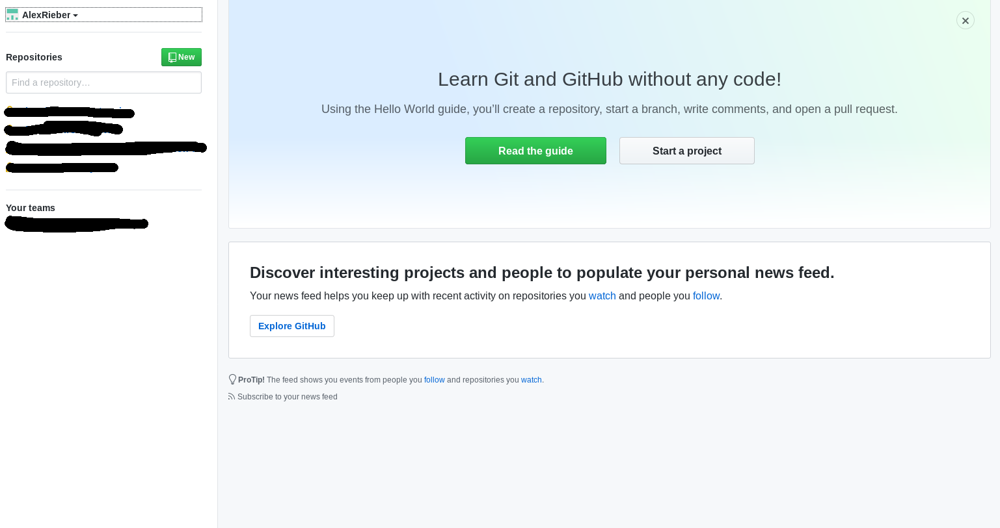
```

---

```{r, echo=FALSE}
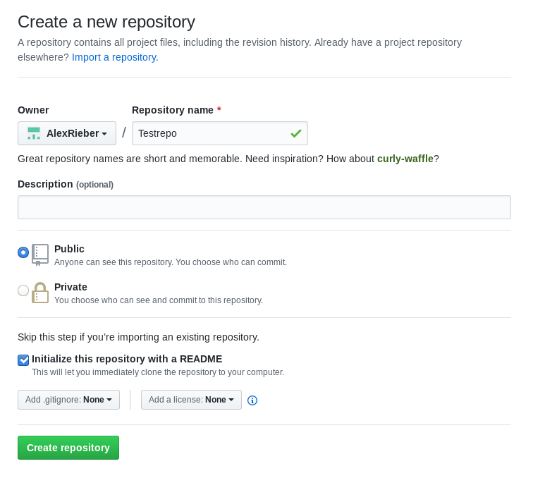
```

---

## Ein neues Repositorium erstellen

- Erstellen Sie einen neuen Ordner `Testrepo` in ihrem aktuellen Verzeichnis:

```{bash, eval=FALSE}
mkdir Testrepo
cd Testrepo
echo "Das ist meine erste Datei. Mit Git werde ich viele interessante Erfahren machen." >> Readme.txt
```

---

## Initialisieren

Wenn Sie nun das Verzeichnis _initialisieren_ wird git dieses Verzeichnis tracken:

> git init

- Die Dateien aktuell **nur** in ihrem aktuellen Verzeichnis
- Die Datei ist aktuell **nicht** in ihrem lokalen Repositorium oder auf Github!

--

Im ersten Schritt müssen Sie ihre Dateien zum _lokalen Repositorium_ hinzufügen:

> git add Readme.txt
> git commit -m "Erster Commit. Readme hinzugefuegt."

---

## Push

Nun müssen Sie noch ihr _remote Repositorium_ verbinden:

> git remote add origin `https://github.com/AlexRieber/Testrepo.git`

--

Und können dann ihre Änderungen zum _remote Repositorium_ **pushen**:

> git push

---

class: center, middle, inverse

# Mergekonflikte

---

## Mergekonflikte

- Können vorkommen, wenn mehrere Personen an der gleichen Datei arbeiten
- Wenn beide die gleiche Zeile bearbeiten und die Datei an das _remote Repositorium_ pushen, dann meldet Git einen **Mergekonflikt**

.question[Gegeben Sie und einer ihrer Partner arbeiten an der gleichen Zeile. Ihr Partner pushed seine Änderungen vor ihnen. Was passier?]

--

- Git zeigt ihnen einen Fehler an
- **Was ist zu tun?** $\rightarrow$ pullen Sie!
- Schauen Sie auf den Merge Konflikt
- Wählen Sie die richtige/präferierte Änderung der Datei aus und bereinigen so den Mergekonflikt
- Committen Sie ihre neue Datei mit einer entsprechenden Nachricht
- Pushen Sie.

---

## Mergekonflikte vermeiden

.instructions[**Pullen** Sie **immer** bevor Sie mit ihrer Arbeit starten, dann sind Sie auf dem aktuellen Stand!]

- Committen und pushen Sie oft um Mergekonflikte zu vermeiden, oder die Änderungen auf ein Minimum zu reduzieren
    - Erspart ihnen viel arbeit!
- Wenn Sie eine Situation nicht lösen können, dann fragen Sie **sofort** nach Hilfe und warten nicht bis das Problem zu groß wird!


---

class: center, middle, inverse

# Git mit RStudio als Alternative zu Github Desktop

---

## Github und RStudio verbinden

.alert[Achtung Advanced: Der folgende Abschnitt ist nur für erfahrene Nutzer, bitte schauen Sie sich die Intro Videos zu Github Desktop an, welche wir ihnen empfehlen!]

---

## Git Name

- Sie sollten nun in RStudio sein
- Dort sollten Sie ein Terminal öffnen (Tools > Terminal > New Terminal)
- Anschließend tragen Sie das folgende ein (Bitte mit ihrem Github-Namen und ihrer Mail für Github):

> git config --global user.name "Github Name"

> git config --global user.mail "Github_Mail@email.com"

- Gehen Sie anschließend zu "Tools > Global Options > Git/SVN"
    - Tragen Sie dort den Pfad zu der vorher heruntergeladenen .exe Datei ein
    - Die ausführbare Datei finden Sie meist unter "C:/Programm Files/Git/bin/git.exe"
- Klicken Sie auf "Create RSA-Key" und geben Sie ein Passwort ein
    - Hier können Sie den Defaults folgen
    
---

## Git mit RStudio

- Kommandozeile ist sehr mächtig um mit git zu arbeiten
- **Allerdings:** Kann am Anfang etwas verwirrend sein
- **Möglichkeit:** Git über RStudio nutzen

--

Erstellen Sie zu Beginn ein Projekt:

> File > New Project > Verison Control > Git

Bei Git tragen Sie ihr First_Repo ein (zur Erinnerung, meins war: https://github.com/AlexRieber/First_repo.git)

- Ihr First_Repo sollte gleich lauten, allerdings mit **ihrem** Github Nutzernamen

---

## Git mit RStudio

Dieser Eintrag wird ein _lokales Repositorium_ auf ihrem Rechner erstellen, je nachdem wo Sie ihren Pfad gesetzt haben (Können Sie durch `Browse` ändern):

```{r, echo=FALSE}
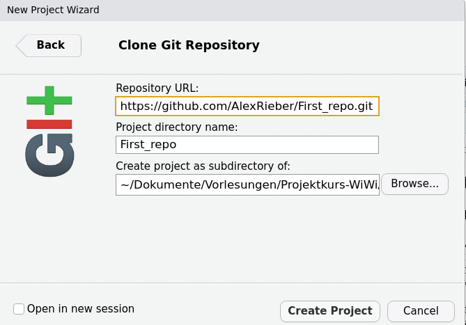
```

---

## Git mit RStudio

- Nun haben Sie ein _lokales Repositorium_ welches bereits eine Verbindung mit ihrem _remote Repositorium_ auf Github hat!
- Oben rechts in RStudio haben Sie nun den Reiter `Git`
- Wenn Sie auf `Git` klicken sehen Sie alle aktuellen Dateien in ihrem Ordner und deren Status (aktuell `untracked`)

```{r, echo=FALSE}
include_graphics("figs/Files-git.png")
```

---

## Git und RStudio

Erzeugen Sie nun ein neues File mit dem Namen `Erste_Pakete.R`
- Dies können sie über File > New File > R Script > Save As ... > Erste_Pakete.R
- Tragen Sie in die Datei `library(tidyverse)` ein und speichern diese ab

.alert[Lokal gespeicherte Dateien sind **nicht** automatisch mit dem Github Repositorium gesynched!]

- Sie müssen `git push` ausführen um die Änderungen zu synchronisieren, dies können Sie auch in RStudio machen und brauchen nicht in die Kommandozeile wechseln!

---

```{r, echo=FALSE, out.width='100%'}
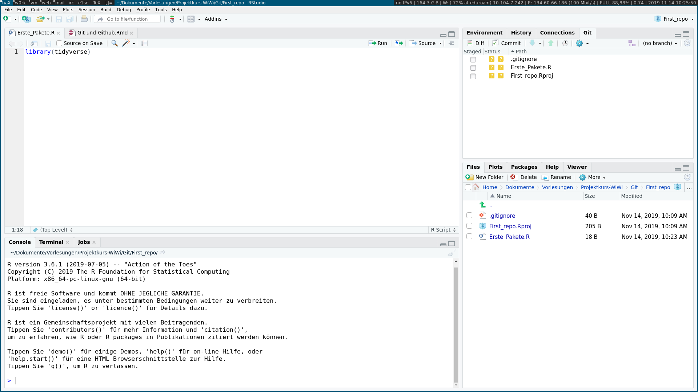
```

---

## Git add mit RStudio

Für Projekte mit mehr als einem Projektteilnehmer gilt **immer** bevor Sie am Projekt arbeiten sollten Sie die Inhalte des _remote Repositoriums_ **pullen**

- Hier arbeiten Sie allen und starten bei Null, daher müssen Sie nicht pullen
- In RStudio wird der Status der Dateien bzgl. _lokalem_ und _remote Repositorium_ rechts oben angezeigt.
- Gelbes Fragezeichen: Git weiß nichts über diese Datei

.question[Müssen wir nun immer in die Kommandozeile wechseln?]

--

- Nein!
- Zuerst müssen wir unsere Dateien zu unserem _lokalen Repositorium_ **adden** (Klicken des `Staged` Buttons)
- Nach dem **adden** wird der Status zu einem grünen A gesetzt

---

```{r, echo=FALSE, out.width='100%'}
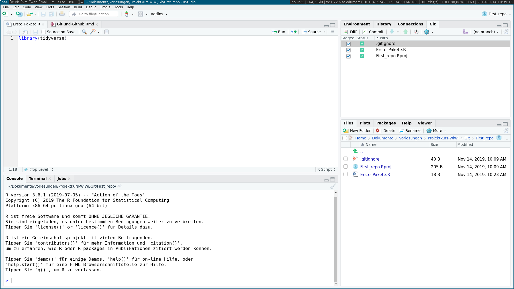
```

---

## Git commit mit RStudio

- Nun können Sie ihre Dateien **committen**
- Klicken Sie hierfür auf den `Commit`-Button
- Nun sollten Sie eine treffende Beschreibung ihres Commits angeben
    - Hier wollen wir nur schreiben, dass wir unsere erste Datei hinzufügen. 

.alert[Je besser und treffender ihre Commit Nachrichten sind, desto besser finden Sie sich später zurecht in ihrem Repositorium!]

---

## Git commit mit RStudio

```{r, echo=FALSE}
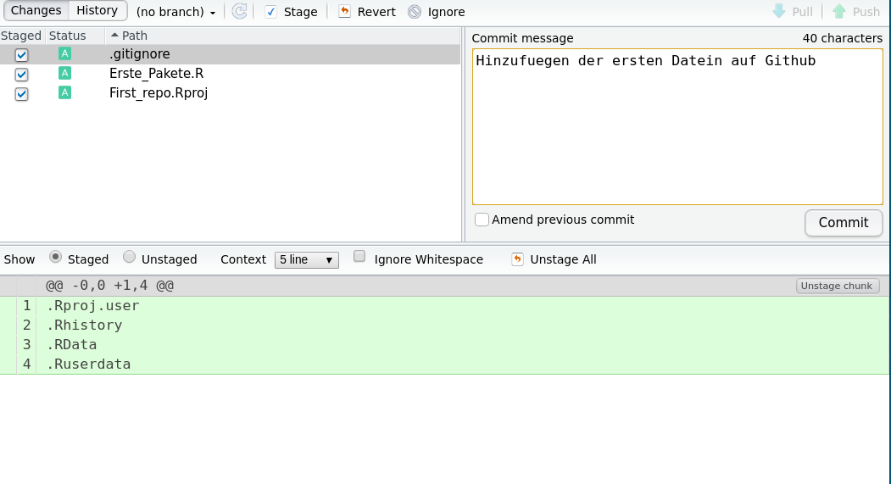
```

--

```{r, echo=FALSE}
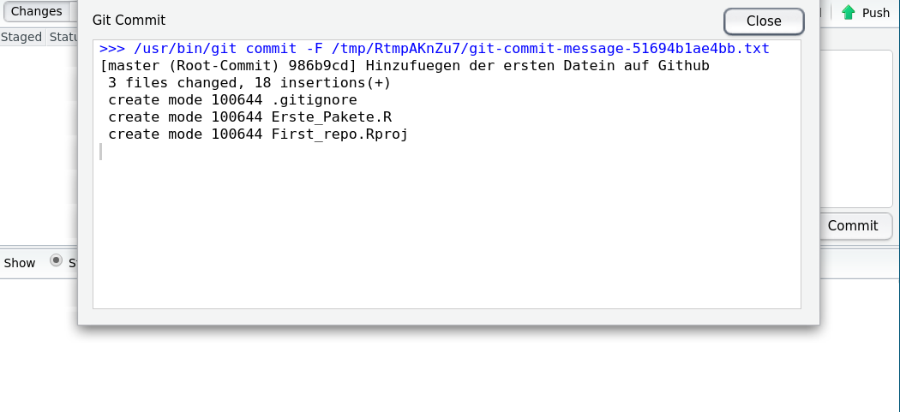
```

---

## Git push mit RStudio

- Aktuell sind ihre Änderungen nur in ihrem _lokalen Repositorium_
- Nun können Sie ihre Änderungen an das _remote Repositorium_ **pushen**
- Klicken Sie hierfür auf den `Push`-Button rechts oben

```{r, echo=FALSE}
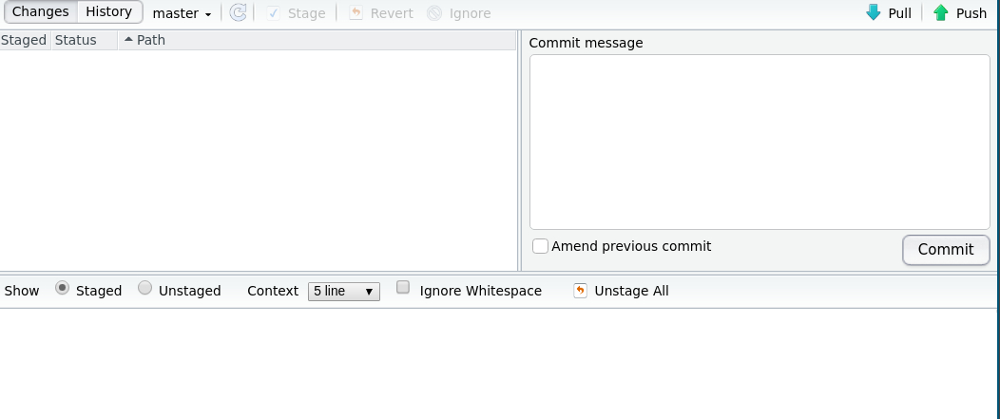
```

---

## Änderungen auf Github sichtbar

- Wenn Sie sich nun bei Github einloggen erscheinen ihre Änderungen in ihrem dortigen Repositorium *First_Repo*

```{r, echo=FALSE}
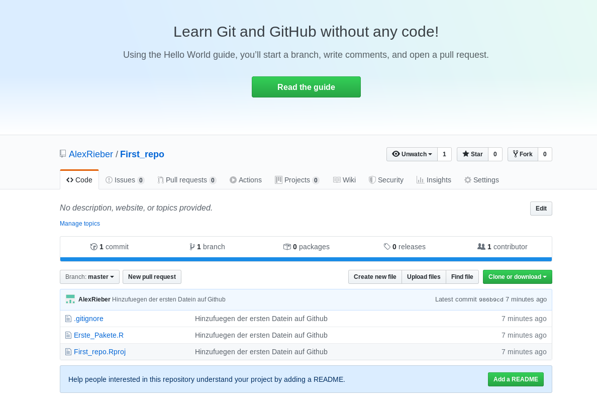
```

